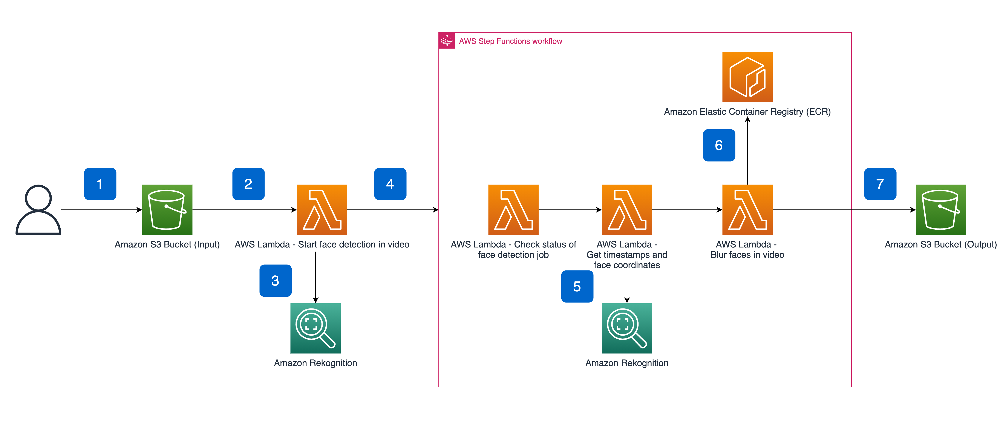

In this tutorial, we will explore how to implement an automated face blurring solution using AWS Lambda and Step Function State Machine. 

Tutorial source: https://aws.amazon.com/blogs/machine-learning/blur-faces-in-videos-automatically-with-amazon-rekognition-video/

Face blurring is one of the best-known practices when anonymizing both images and videos.
We will implement an event-driven system for face blurring using composition of different Lambda functions and a state machine.

Here is the high level architecture:

Let's get started.

**\* Deploy your resources in a region where [Amazon Rekognition is supported](https://docs.aws.amazon.com/general/latest/gr/rekognition.html).**
