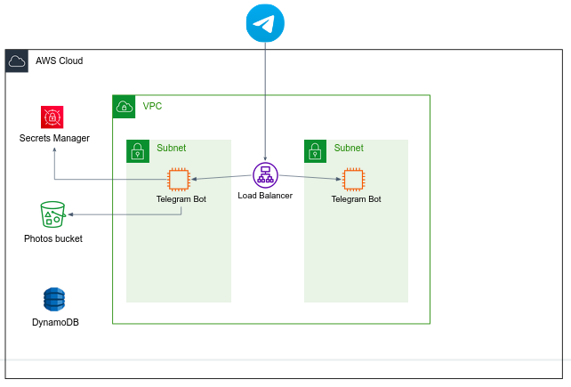

### Guidelines

- The Polybot service should be running within a `micro` EC2 instance, as a single Docker container. Code skeleton can be found under `aws_project/polybot`. The container should be running when the machine is launched (use `docker run --restart=always` or any other method).
- Create a prototype EC2 instance with the Polybot container running inside. From that instance create **an AMI** that will be used to launch any other Polybot instance.  
- The service should be highly available (provisioned in at least two different AZ). For that, you'll use an **Application Load Balancer (ALB)** that routes the traffic across the Polybot instances.    
- The ALB must listen on **HTTPS** as setting an HTTP webhook URL in Telegram servers [is not allowed](https://core.telegram.org/bots/webhooks). To use HTTPS you need a TLS certificate. You can [generate a self-signed certificate](https://core.telegram.org/bots/webhooks#a-self-signed-certificate) and import it to the ALB listener. In that case the certificate `Common Name` (`CN`) must be your ALB domain name, and you must pass the certificate file when setting the webhook in `bot.py` (e.g. `self.telegram_bot_client.set_webhook(..., certificate=open(CERTIFICATE_FILE_NAME, 'r'))`).
  
- If you want to limit access to the ALB to Telegram servers only, allow traffic from `149.154.160.0/20` and `91.108.4.0/22` in the ALB security group.
- The service should **not** be auto-scaled, 2 instances are enough.
- Your Telegram token is a sensitive data. It should be stored in [AWS Secret Manager](https://docs.aws.amazon.com/secretsmanager/latest/userguide/intro.html). Create the corresponding secret in Secret Manager, under **Secret type** choose **Other type of secret**.