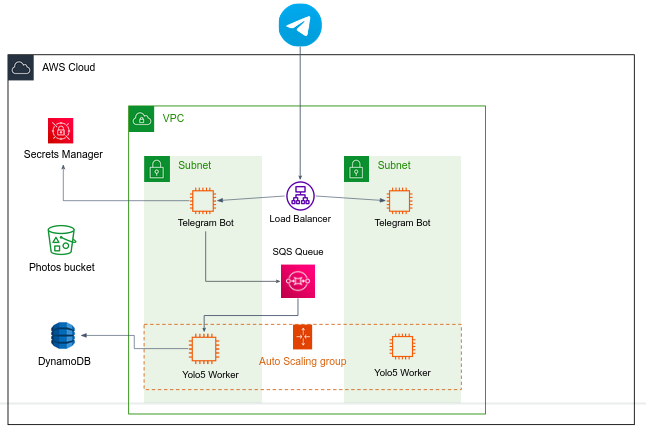

### Guidelines

- The Yolo5 service should be running within a `micro` EC2 instance, as a single Docker container. The service files can be found in `aws_project/yolo5`. In `app.py` you'll find a code skeleton that periodically consumes jobs from an SQS queue. 
- **Polybot -> Yolo5 communication:** When the bot receives a message from Telegram servers, it should upload the image to the S3 bucket. 
    Then, instead of talking directly with the Yolo5 service using a simple HTTP request, the bot sends a "job" to an **SQS queue**.
    The job message contains information regarding the image to be processed, as well as the Telegram `chat_id`.
    The yolo5 service acts as a consumer, consumes the jobs from the queue, downloads the image from S3, process the image, and writes the results to a **DynamoDB table** (instead of MongoDB, change your code accordingly).
- **Yolo5 -> Polybot communication:** After writing the results to DynamoDB, the Yolo5 service then sends a `GET` HTTP request to the `/results?predictionId=<predictionId>` endpoint of the Polybot, while `<predictionId>` is the current prediction ID. The request is done via the ALB address (HTTPS is not necessary here since this is an internal communication between microservices).
    The `/results` endpoint then retrieve the results from DynamoDB and sends them to the end-user.
- The service should be **auto-scaled**. For that you'll use an **AutoscalingGroup**. In the next section we'll discuss the policy according which this service is going to be scaled in and out. 
- From cost considerations, your ASG desired and minimum capacity **must be 0**.