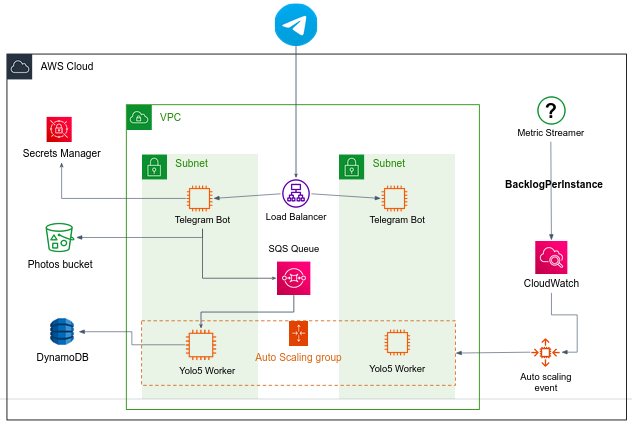

We now introduce new microservice in the architecture, `metricStreamer`, which will help us to scale in and out the Yolo5 service. 

Obviously, the number of Yolo5 instances needed, depends directly on the numbers of jobs in the SQS queue. 
If the queue is overloaded, we need many Yolo5 instances. If there are only 5 messages in the queue, we don't need 50 instances, right? 

We configure the AutoscalingGroup to perform scale in/out according to the **number of messages in the queue, per Yolo5 instances**. We call this value `BacklogPerInstance`.

For example, assuming you have 10 Yolo5 instances up and running, and 100 jobs in the queue, thus `BacklogPerInstance` equals 10, since each Yolo5 instance has to consume ~10 messages to get the queue empty.
For more information, read [here](https://docs.aws.amazon.com/autoscaling/ec2/userguide/as-using-sqs-queue.html).

The `metricStreamer` microservice's goal is to calculate the value of the `BacklogPerInstance` metric every 30 seconds and [send it to **CloudWatch**](https://boto3.amazonaws.com/v1/documentation/api/latest/guide/cw-example-metrics.html#publish-custom-metrics). 

Here is a code skeleton for this microservice:

```python
sqs_client = boto3.resource('sqs', region_name='')
asg_client = boto3.client('autoscaling', region_name='')

AUTOSCALING_GROUP_NAME = ''
QUEUE_NAME = ''

queue = sqs_client.get_queue_by_name(QueueName=QUEUE_NAME)
msgs_in_queue = int(queue.attributes.get('ApproximateNumberOfMessages'))
asg_groups = asg_client.describe_auto_scaling_groups(AutoScalingGroupNames=[AUTOSCALING_GROUP_NAME])['AutoScalingGroups']

if not asg_groups:
    raise RuntimeError('Autoscaling group not found')
else:
    asg_size = asg_groups[0]['DesiredCapacity']
    
backlog_per_instance = msgs_in_queue / asg_size

# TODO send backlog_per_instance to cloudwatch...
```

### Guidelines

- Implementing and provisioning this service in AWS is up to your choice.
  You can simply wrap the above code with a `while True` loop that iterates every 30 seconds, or using a Lambda function that is being triggered periodically, or any other method... 
- To scale your AutoscalingGroup in/out based on the `BacklogPerInstance` metric, use AWS cli to create a [target tracking scaling policy](https://docs.aws.amazon.com/autoscaling/ec2/userguide/as-using-sqs-queue.html#create-sqs-policies-cli) for your AutoscalingGroup.
  Change `MetricName` and `Namespace` values according to the metric you send to CloudWatch.
  Give the `TargetValue` some value that you can test later (e.g. 10, which means if there are more than 10 messages per Yolo5 in the SQS queue, a scale out event will trigger).
- Create an AMI from a prototype Yolo5 instance and base your **AutoscalingGroup Launch Template** on that AMI, such that when a new instance is created from the launch template, the Yolo5 app will be automatically up and running, starting to consume jobs from the SQS queue.