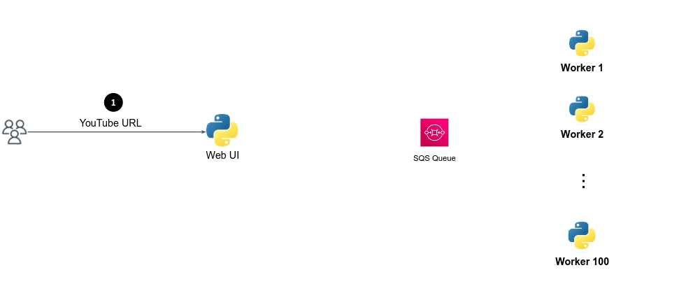

To address the scalability and fault tolerance issues, we can introduce an SQS (Simple Queue Service) queue between the Frontend and Worker microservices.
SQS can help **decouple the communication between microservices**:

1. The Frontend microservice acts as a user web interface, allows users to provide a link to YouTube video and click the submit button to start the processing (**step 1**).
2. The Frontend microservice, acting as a **producer**, sends the YouTube URL as a **message** (a.k.a. **job**) to the SQS queue (**step 2**) instead of directly calling the Worker microservice.
3. The SQS queue immediately responds with "accepted" message to the Frontend, indicating that the job has been queued (**step 3**), the Frontend then responds with "Your message is being processed" message to the client (**step 4**). 
   Note that this is done before the job has been processed by some Worker.
4. Whenever a Worker is free, it pulls the next job from the head of the queue (**step 5**) and process it (**step 6**). 
   By this means, the Worker is known as a **consumer**, as it consumes and processes jobs, empties the queue.

This **asynchronous architecture** decouples the communication between the two microservice, allowing the Frontend service to respond quickly to user requests without waiting for the Worker service to process the URL. 

Multiple instances of the Worker microservice can be deployed to process messages from the SQS queue in parallel.
If the Worker microservice faces a failure, messages in the SQS queue are not lost. The messages will remain in the queue until they are successfully processed by some Worker. 
Even if one instance of the Worker microservice becomes unavailable, other instances can continue processing the queued messages, ensuring redundancy and high availability.

We'll see this architecture in action. First let's create and experiment with an SQS queue. 
