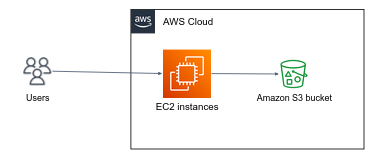

In modern cloud-based applications, S3 is often used as a central data store, while EC2 instances are used to run the application logic. When end-users interact with the application, the application processes the user input and reads or writes data to S3 on their behalf. 

For instance, in a photo-sharing application like Instagram, users upload their photos via the web application. The application backend then manages the storage and retrieval of the photos from S3, allowing for efficient storage and delivery of the content.

By this means, uploading object to S3 using the web console is useless. We are interested in communicating with S3 from within EC2 instance, either via the `aws` cli, or Python code.  

**Disclaimer:** This is not going to work. Your EC2 instance has to have permissions to operate in S3.

1. Connect to your EC2 instance over SSH.
2. Read the [examples](https://docs.aws.amazon.com/cli/latest/reference/s3api/put-object.html#examples) in AWS code and write a command to upload (`put-object`) in your S3 bucket (you may need to install the `aws` cli on your machine).
3. Got `Unable to locate credentials.` or `Access Denied`? follow the next section...
