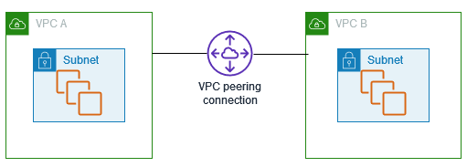

## Optional practice 

### Exercise 1 -  Create a flow log that publishes to Amazon S3

VPC Flow Logs is a feature that enables you to capture information about the IP traffic going to and from network interfaces in your VPC. Flow log data can be published to the following locations: Amazon CloudWatch Logs, Amazon S3, or Amazon Kinesis Data Firehose. 

https://docs.aws.amazon.com/vpc/latest/userguide/flow-logs-s3.html

### Exercise 2 - VPC peering 

Can be done in pairs.

A VPC peering connection is a networking connection between two VPCs that enables you to route traffic between them privately. Resources in peered VPCs can communicate with each other as if they are within the same network. You can create a VPC peering connection between your own VPCs, with a VPC in another AWS account, or with a VPC in a different AWS Region. Traffic between peered VPCs never traverses the public internet.

Follow AWS documentation on VPC peering (https://docs.aws.amazon.com/vpc/latest/peering/what-is-vpc-peering.html) to create a simulated networking scenario. 

### Exercise 3 - Create a VPC endpoint to access CloudWatch

https://docs.aws.amazon.com/vpc/latest/privatelink/getting-started.html