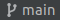

1. Open **our shared git repo** in PyCharm.
1. Make sure you are on the Git branch `main`. If the bottom right bar in your PyCharm is looking different than the image below, click on it, hover the `main` branch and click **Checkout**.

1. On branch `main`, pull the repository pictured below to get an up-to-date version.

1. From the PyCharm bottom right bar, click the button pictured below to display Git branches in the repo. Choose **+ New branch**.

1. In the opened window, give your branch a name according to the following template:
    ```bash
    bash_project/<alias>
    ```

While changing `<alias>` to your nickname. e.g. `bash_project/alonit`. In this exercise, the branch name must start with `bash_project/`.

Let's get started...