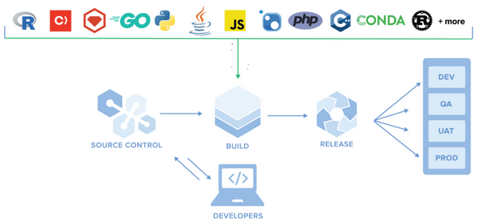

When committing and pushing changes regularly by a large development team, Jenkins can execute hundreds of build jobs every day. 
Every build can potentially download (or create) hundreds of python packages, docker base images, AI model binaries, configuration files, executable binaries etc..

We call these files **artifacts**, or binaries. Artifact is a file, which is downloaded or created as part of the CI/CD pipeline. 

We can divide artifacts into two groups - artifacts that you create (e.g. docker image you built), or artifacts that your application relies on, but you haven't developed them yourself (e.g. python package you're installing from PyPI or docker base image provided by a DockerHub).

There are several problems that arise with artifacts:

- How can we make sure a vulnerability is not propagated to our production system? 
- Large artifacts (like Docker base image) can significantly slowing down the build time. 
- By using artifact that is protected by restricted license, your team can innocently violate software licensing.

## Spot check 

How might large artifacts, like Docker base images, impact the build time of a CI/CD pipeline?

  

     Solution
  

    Large artifacts, such as Docker base images, can significantly increase the build time of a CI/CD pipeline due to the time it takes to download, transfer, or build these large images.
    

