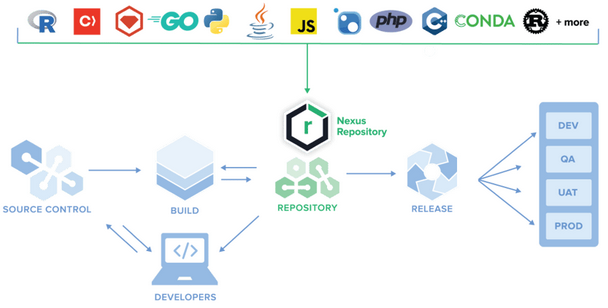

[Nexus Artifact Manager](https://www.sonatype.com/products/sonatype-nexus-repository) is used to store and manage your artifacts. Here are its key features:

- Can store various types of artifacts, including Maven, PyPi packages, Docker images, Helm charts, and more.
- Acts as a proxy for remote repositories, fetching and caching artifacts from external sources like PyPI (see figure below). This helps improve build speed by reducing the need to download artifacts repeatedly.
- Single source of truth for all environments, including developer's local machine. This ensures that the correct versions of dependencies are used, leading to more reliable builds and deployments.
- Nexus can manage the lifecycle of artifacts, including promote and release versions of your artifacts.
- Nexus provides reporting and monitoring tools to track artifact usage, repository health, vulnerabilities and software licensing violation.

## Spot check 

Let's say you are not allowed to use some Python package in production environment due to license restrictions. 

Take a look at the diagram above where Nexus is depicted, how does Nexus help to make sure the that your development team would not be using this package on their local machines as well? 

  

     Solution
  

    Both developers, and the version built for production installed the Python package from the same source, from the Nexus server. Any restriction rule that was configured for production builds, can potentially be applies for developers local use. 

