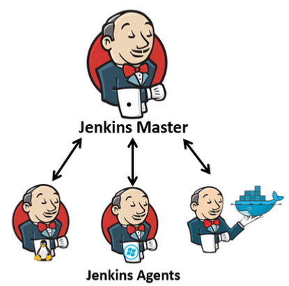

We now want to focus on the machine in which Jenkins executes jobs. 
So far, all jobs have been executed in the Jenkins server itself. But this is far from being optimal. Why?

- Performance: Many heavy jobs can reduce the server performance. The Jenkins server should be free to schedule the jobs, but not to execution them.
- Build environments: What if we need to execute jobs on Windows environment, while the Jenkins server is running on Linux?
- Isolation: A job script can potentially access Jenkins secrets files, or data of another job, or to configure the OS in a way that impacting other currently running jobs. Remind yourself that Jenkins is a central platform that has access to all environments, it's deploying our apps to production as well as development environment. We want a complete isolation between jobs. 

Instead, let's introduce [distributed builds architecture](https://www.jenkins.io/doc/book/scaling/architecting-for-scale/#distributed-builds-architecture), while delegating the jobs execution to other machine(s), which will be called **Jenkins agents**.

Jenkins agents, also known as Jenkins slaves, are a fundamental part of the Jenkins automation system. They serve as the execution environment for Jenkins builds and tasks. 

(Image by https://foxutech.com/author/motoskia/)
