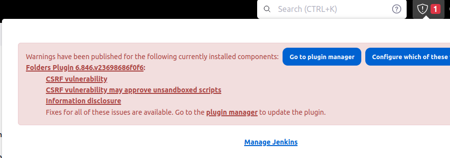

Most standard administrative tasks can be performed from the screens in the **Manage Jenkins** section of the dashboard.

Let's take a look on some of them:

- **System**: Configure global settings and paths for the Jenkins instance.
- **Plugins**: Add, update, remove, disable/enable plugins that extend the functionality of Jenkins. 
- **Nodes and Clouds**: Add, remove, control, and monitor the nodes used for the agents on which build jobs run.
- **Manage Credentials**: Configure the credentials that provide secure access to third-party sites and applications that interact with Jenkins.
- **Users**: Manage users defined in the Jenkins user database. This is not used if you use a different security realm such as LDAP or AD.
- **System Information**: Displays information about the Jenkins environment.
- **System Log**: Jenkins log that contains all java.util.logging output related to Jenkins.

More information can be found [here](https://www.jenkins.io/doc/book/managing/).

## Update plugins 

Jenkins plugin updates are essential for maintaining compatibility, security, and functionality, as they ensure that the latest features and bug fixes are incorporated into the Jenkins ecosystem.

As your Jenkins server will be used not only during this module, but actually up to the end of course, 
you are expected to maintenance your server (as if it is functioning for a real project). Update your plugins when needed. 

The below screenshot (taken from the top right bar in the main Jenkins dashboard) warns the user regarding available plugin update.

You can also see and perform updates in **Manage Jenkins** > **Manage Plugins**.

## The `jenkins` user and its home directory

When installed Jenkins, a `jenkins` linux user was created during the installation process and is used to execute Jenkins processes and manage its files.
Jenkins stores its global configuration in files on the `jenkins` home directory. On Ubuntu by default, this is set to `/var/lib/jenkins`. 

Jenkins uses this directory to store configurations, to perform builds and keep archives. 
