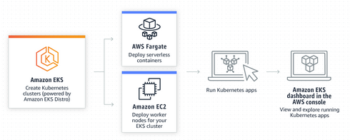
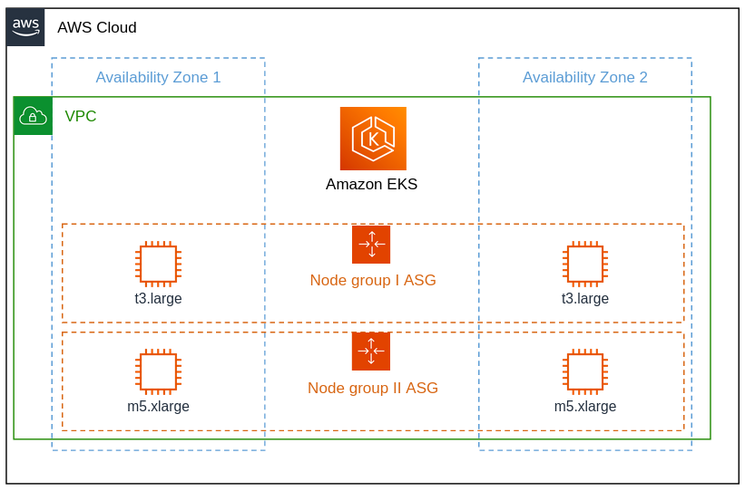

A fresh EKS cluster does have the Control Plane server, doesn't have Nodes.

EKS cluster offer different approaches to create and manage Nodes:

1. **EKS managed node groups**: EKS create and manage the cluster EC2 instances for you. Just choose an instance type, minimum and maximum number of Nodes. 
2. **Self-managed nodes**: you manually add EC2 instances to the cluster. You have to create the instances yourself, configure them and connect them to the cluster Control Plane.  
3. **AWS Fargate**: a technology that provides on-demand, right-sized compute capacity without even seeing the EC2 instances. You don't have to provision, configure, or scale groups of virtual machines on your own. Just schedule a Pod and AWS will take control on compute themselves (feels like "serverless" cluster). 

We will use the **EKS manage node groups** approach. 




### EKS managed node groups

Managed node groups are a blend of automation and customization for managing a collection of EC2 instances within an EKS cluster.
AWS takes care of tasks like patching, updating, and scaling nodes, easing operational aspects.





Amazon EKS provides specialized AMIs that are called [Amazon EKS optimized AMIs](https://docs.aws.amazon.com/eks/latest/userguide/eks-optimized-ami.html).
The AMIs are configured to work with Amazon EKS.


To create a managed node group using the AWS Management Console:

1. Wait for your cluster status to show as `ACTIVE`.
2. Open the Amazon EKS console at https://console.aws.amazon.com/eks/home#/clusters.
3. Choose the name of the cluster that you want to create a managed node group in.
4. Select the **Compute** tab.
5. Choose **Add node group**.
6. On the **Configure node group** page, fill out the parameters accordingly. 
   - **Node IAM role** – Choose the node instance role to use with your node group. [Read here how to do it](https://docs.aws.amazon.com/eks/latest/userguide/create-node-role.html#create-worker-node-role).
   - **Minimum size** - **1**.
   - **Maximum size** - **2**.
7. On the **Set compute and scaling configuration** page, fill out the parameters accordingly:
   - **Instance types** - Choose `t*.medium`.
8. Watch the status of your nodes and wait for them to reach the `Ready` status:
  ```bash
  kubectl get nodes --watch
  ```
