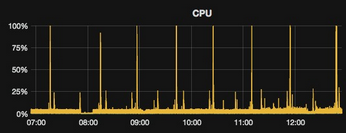
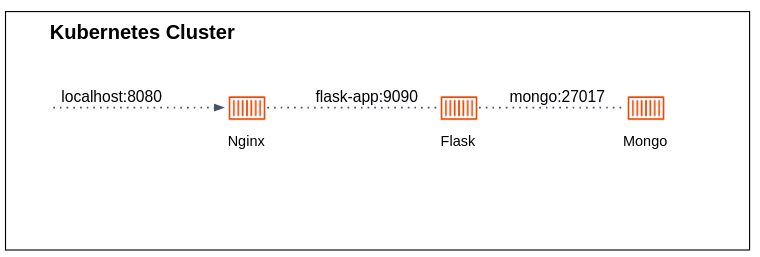

### Exercise 1 -  Grafana and Redis dashboard

In this exercise you deploy a [Grafana](https://grafana.com/) server with [Redis integration](https://grafana.com/grafana/plugins/redis-datasource/) that present information about the `redis-cart` DB provisioned in the cluster as part of the Online Boutique Service. 

1. Create a grafana Deployment based on [`grafana/grafana`](https://hub.docker.com/r/grafana/grafana) docker image, as follows:
  - The Deployment should set the following environment variables:
    - `GF_AUTH_BASIC_ENABLED` with a value equals to `true`.
    - `GF_SECURITY_ADMIN_USER` and `GF_SECURITY_ADMIN_PASSWORD` variables **to be read from dedicated Secret object** that you'll create with corresponding username and password (to your choice).
    - `GF_INSTALL_PLUGINS` with the value `redis-datasource`. This variable pass the plugins you want to install when the container is being launched.
2. Visit the server (you can forward it using the `kubectl port-forward` command).
3. Configure the Redis datasource [as described here](https://grafana.com/grafana/plugins/redis-datasource/?tab=overview). The data source should read data from the existed `redis-cart` provisioned in your cluster. 
4. In the **Redis** data source page, click on the **Dashboards** tab, and import the `Redis` dashboard. Take a look on the imported dashboard.   
4. **(Bonus)** Instead of configuring the Redis datasource manually, configure it "as code" using a ConfigMap:
    - Create a ConfigMap as follows:
      ```yaml
      apiVersion: v1
      kind: ConfigMap
      metadata:
        name: grafana-datasources
      data:
        datasources.yaml: |-
          {
              "apiVersion": 1,
              "datasources": [
                {
                  "version":2,
                  "name":"Redis",
                  "type":"redis-datasource",
                  "url":"redis-cart:6379",
                  "isDefault":true
                }
              ]
          }
      ```
    - Mount the configmap into `/etc/grafana/provisioning/datasources` directory within the container. The Grafana server read all `.yaml` files in this dir and applies the data sources configurations. 
    - Make sure the datasource is configured on a clean Grafana deployment. 

### Exercise 2 - Create a Job

The [Job workload](https://kubernetes.io/docs/concepts/workloads/controllers/job/) is a way to reliably run "jobs" is the cluster, i.e. to run a Pod(s) **until a successful completion**. 
The Job object will continue to retry execution of the Pods until pods successfully complete (it will start a new Pod if the Pod fails or deleted). 

When a Job completes, the Pods are usually not deleted.
Keeping them around allows you to view the logs of completed pods to check for errors, warnings, or other diagnostic output.
The job object also remains after it is completed so that you can view its status. 

Let's say you try to investigate an issue regarding imbalanced traffic distribution in your `frontend` service replicas. 
For that you want to create a simple Job that performs 100 HTTP requests to the service.

1. Increase the number of replicas of the `frontend` service to be at least 2.
2. Use [this](https://kubernetes.io/docs/concepts/workloads/controllers/job/#running-an-example-job) manifest example to create the Job. 
  - The `image` should be `busybox:1.28`.
  - The `command` can be `/bin/sh -c "for run in {1..100}; do wget -q -O- http://frontend:80; done"`.
3. Apply the Job.
4. Observe the Job logs to make sure it's running properly.
5. Check the containers log of both `frontend` replicas (using `kubectl logs` command), make sure there is an incoming requests traffic. 


### Exercise 3 - CronJobs 

A [CronJob](https://kubernetes.io/docs/concepts/workloads/controllers/cron-jobs/) creates Jobs on a repeating schedule.

You monitor the response time of the `adservice` application (responsible for the advertising in the Online Boutique) and notice the following anomalies:




From time to time, there are small amount of requests for which the response time in X10 greater the average.
You investigate the issue and discover that JVM-based applications need to stay "warmed-up" to stay at their top speed. 

Create a simple CronJob that runs every 30 seconds and performs a single request to to the `adservice`. 

- The client code is already given to you under `k8s/adservice-client`.
- You have to build the image.
- The image is expected 2 environments variable: `AD_SERVICE_HOST` and `AD_SERVICE_PORT`, which are host and port of the advertising service deployed in your cluster.
- Base your CronJob on the [the example from k8s official docs](https://kubernetes.io/docs/concepts/workloads/controllers/cron-jobs/#example).

### Exercise 4 - Docker Compose migrated to K8S 

Under `k8s/nginx_flask_mongodb` you'll find a Docker Compose project.




Migrate the `nginx`, `flask-app` and `mongo` services to your k8s cluster.
Use Deployment, Service and ConfigMap objects. 

Make sure the app is working by:

```bash
kubectl port-forward <nginx-service-or-pod> 8080:80
```

Then visit the app in `http://localhost:8080`. 

### Exercise 5 - Deploy the 2048 game

Create a **Deployment** for the [2048 game dockerized image](https://hub.docker.com/r/alexwhen/docker-2048).
Expose the Deployment with a **Service** listening on port `5858`. Visit the app locally using `kubectl port-forward` command.
