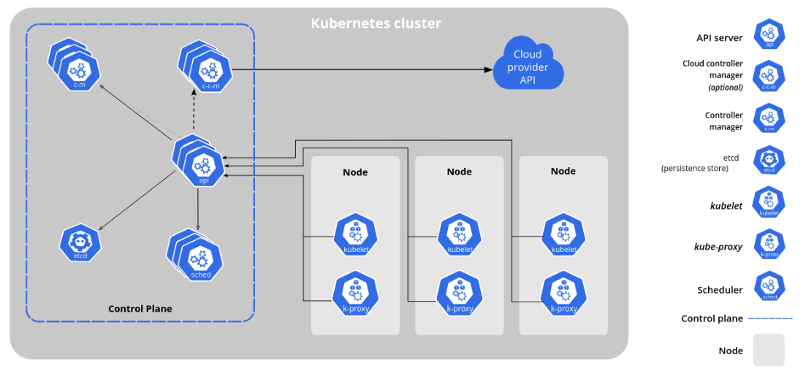

When you deploy Kubernetes (using minikube, or any other distro), you get a **cluster**.

A Kubernetes cluster consists of a set of worker machines, called **nodes**, that run containerized applications (known as **Pods**).
Every cluster has at least one worker node.

The **control plane** manages the worker nodes and the Pods in the cluster.
In production environments, the control plane usually runs across multiple computers and a cluster usually runs multiple nodes, providing fault-tolerance and high availability.



#### Control Plane main components

The control plane's components make global decisions about the cluster (for example, scheduling), as well as detecting and responding to cluster events (for example, starting up a new pod when a deployment's replicas field is unsatisfied).

- **kube-apiserver**: The API server is the front end for the Kubernetes control plane.
- **etcd**: Consistent and highly-available key value store used as Kubernetes' backing store for all cluster data.
- **kube-scheduler**: Watches for newly created Pods with no assigned node, and selects a node for them to run on.
- **kube-controller-manager**: Runs [controllers](https://kubernetes.io/docs/concepts/overview/components/#kube-controller-manager). There are many different types of controllers. Some examples of them are:
  - Responsible for noticing and responding when nodes go down.
  - Responsible for noticing and responding when a Deployment is not in its desired state.

#### Node components

Node components run on every node, maintaining running pods and providing the Kubernetes runtime environment.

- **kubelet**: An agent that runs on each node in the cluster. It makes sure that containers are running in a Pod.
- **kube-proxy**: kube-proxy is a network proxy that runs on each node in your cluster. It allows network communication to your Pods from network sessions inside or outside your cluster.
- **Container runtime**: It is responsible for managing the execution and lifecycle of containers ([containerd](https://containerd.io/) or [CRI-O](https://cri-o.io/)).


### Kubernetes API server and the `kubectl` cli

The core of Kubernetes' control plane is the **API server**. The API server exposes an HTTP API that lets you communicate with the cluster, and let k8s components communicate with one another.

Usually you don't communicate with the API server directly, but using `kubectl`, which internally communicates with the API server on your behalf.

For example, to list your Pods:

```console
$ kubectl get pods
NAME                               READY   STATUS    RESTARTS   AGE
flask-deployment-7f6549f7b6-6lm9k  1/1     Running   0          2m
```

The above output shows only the running Pods in the `default` namespace. 
In Kubernetes, **namespaces** provides a mechanism for isolating groups of resources within a single cluster.

To list Pods from all namespaces:


```console
$ kubectl get pods --all-namespaces
NAMESPACE              NAME                                         READY   STATUS    RESTARTS      AGE
kube-system            coredns-5d78c9869d-rdzzt                     1/1     Running   2 (9h ago)    10h
kube-system            etcd-minikube                                1/1     Running   2 (9h ago)    10h
kube-system            kube-apiserver-minikube                      1/1     Running   2 (9h ago)    10h
kube-system            kube-controller-manager-minikube             1/1     Running   2 (9h ago)    10h
kube-system            kube-proxy-cs4mq                             1/1     Running   2 (9h ago)    10h
kube-system            kube-scheduler-minikube                      1/1     Running   2 (9h ago)    10h
kube-system            storage-provisioner                          1/1     Running   5 (26m ago)   10h
kubernetes-dashboard   dashboard-metrics-scraper-5dd9cbfd69-64kvk   1/1     Running   2 (9h ago)    10h
kubernetes-dashboard   kubernetes-dashboard-5c5cfc8747-9wsj6        1/1     Running   3 (9h ago)    10h
```

`kubectl` can communicate with multiple existed k8s clusters. To change the cluster with which `kubectl` is communicating:

```console 
$ kubectl config use-context my-production-cluster
Switched to context "my-production-cluster".

$ kubectl config use-context my-dev-cluster
Switched to context "my-dev-cluster".
```

### Organizing cluster access using kubeconfig files

How `kubectl` "knows" our minikube cluster? 

`kubectl` uses **kubeconfig file** to find the information it needs to choose a cluster and communicate with the API server of a cluster.

By default, `kubectl` looks for a file named `config` in the `$HOME/.kube` directory. 
Let's take a look on your `~/.kube/config`. The three main entries are `users`, `clusters` and `contexts`. 

- `users` are identities, defined by certificate and key. 
- `clusters` defines certain cluster information that you may want to interact with. Each entry under clusters typically includes the cluster name, the cluster's API server URL, and the CA certificate used to verify the authenticity of the cluster's API server certificate.
- A `context` is used to group access information under a convenient name. Each context has three parameters: `cluster`, `namespace`, and `user`, which basically says: "Use the credentials of the user X to access the Y namespace of the Z cluster".


## Spot check

Which `kubectl` command can display your kubeconfig file? 


<details>
  <summary>
     Solution
  </summary>
    `kubectl config view`
</details>


