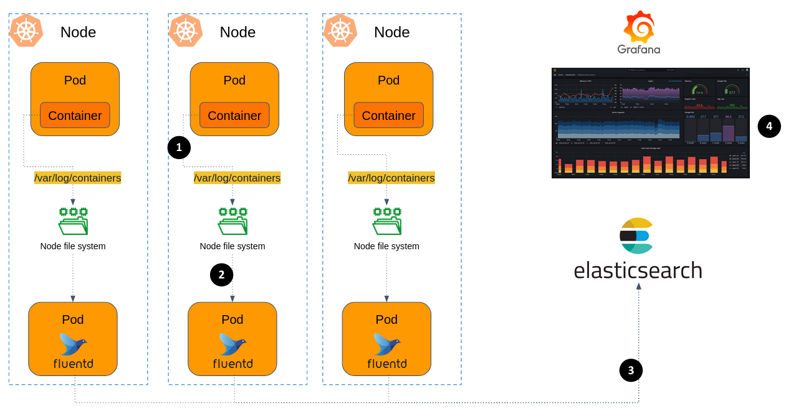

[Fluentd](https://www.fluentd.org/) is an open source data collector, which lets you unify the data collection and consumption for a better use and understanding of data.

Instead of writing your custom code that reads logs from one data source (e.g. MongoDB) and writes it to another storage (e.g. S3), FluentD offer a robust logs collector, which works many different [data sources](https://www.fluentd.org/datasources) and [data outputs](https://www.fluentd.org/dataoutputs).

| Before                                                 | After                                                        | 
|--------------------------------------------------------|--------------------------------------------------------------|
| 
 |  |

Fluentd has a flexible plugin system that allows the community to extend its functionality. There are [500+ community-contributed plugins](https://www.fluentd.org/plugins) that connect dozens of data sources and data outputs. 

### Deploying FluentD in Kubernetes

Our goal is to build a robust mechanism to collect logs from all Pods in the cluster, into a database (Elasticsearch). Then visualize the logs for different purposes using a dashboarding tool (Grafana). 

Here is the architecture:

1. [Pods in k8s cluster write logs](https://kubernetes.io/docs/concepts/cluster-administration/logging/) to `stdout` as well as to a log file located in `/var/log/containers/`. 

> #### Try it yourself
> 
> SSH into one of your cluster's node, take a look on `/var/log/containers` dir.

2. Now we want to deploy FluentD in our cluster, that collects the logs in real-time from every Node.

   FluentD will be deployed as a **DaemonSet**. 
   A DaemonSet ensures that **exactly one** instance of Pod runs on each node within the Kubernetes cluster. 
   
   Since logs collection involving reading log files from every Node, we want an instance of FluentD in each Node, otherwise we deal with cumbersome inter-node communication, increase traffic load, and potential data loss.
   When Fluentd is deployed as a DaemonSet, each node has its own Fluentd instance responsible for collecting logs from the containers running on that node. 

3. Each FluentD Pod is collecting logs into a local buffer, and every interval, sends the collected data into Elasticsearch (also will be deployed in the cluster).
   Elasticsearch is a No-SQL database. It is designed to handle large volumes of data and provides near real-time search and analytics capabilities. Elasticsearch is often used as the underlying engine for applications that require full-text search, log and event data analysis.

4. The Grafana server will visualize logs stored in Elasticsearch. 

Let's get started. Here are general guidelines, try to handle the deployment details yourself 💪:

1. Utilize `k8s/elasticsearch.yaml` to deploy Elasticsearch.
1. Provision FluentD using the [official Helm Chart](https://github.com/fluent/helm-charts/tree/main/charts/fluentd). In `k8s/fluent-values.yaml` you'll find a chart values override for FluentD to send traffic to your Elastic instance.  
1. Make sure Elastic receives data from FluentD. 
1. Visit your Grafana server, integrate the Elastic instance as a data source. 
1. In Grafana, enter the **Explore** page, observe the collected logs. 

