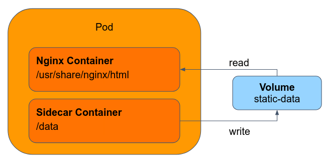

As we said, a Pod is a group of one or more containers.
The containers in a Pod are automatically co-located and co-scheduled on the same physical or virtual machine in the cluster.

Grouping containers in a single Pod is a relatively advanced and **uncommon** use case. 
You should use this pattern only in specific cases in which your containers are tightly coupled.

For example, you might have an `nginx` container that acts as a web server for files in a shared volume, and a separate "helper" container that updates those files from a remote source:




This pattern is called a **Sidecar**:

```yaml
# k8s/sidecar-demo.yaml

apiVersion: v1
kind: Pod
metadata:
  name: mc1
spec:
  containers:
    - name: webserver
      image: nginx
      volumeMounts:
      - name: html
        mountPath: /usr/share/nginx/html
    - name: helper
      image: debian
      volumeMounts:
      - name: html
        mountPath: /html
      command: ["/bin/sh", "-c"]
      args:
        - while true; do
            date >> /html/index.html;
            sleep 1;
          done
  volumes:
    - name: html
      emptyDir: {}
```

Apply the above manifest and observe the server behaviour. 

Other multi-container Pod patterns are **Proxies** and **Adapters**:

- **Proxies:** Acts as a proxy to the mian container. For example, an Nginx container that pass the traffic to a Flask backend server.
- **Adapter:** Used to standardize and normalize application input and output. For example, integrating a legacy system with a new framework by introducing an adapter container that translates calls between the two interfaces.

