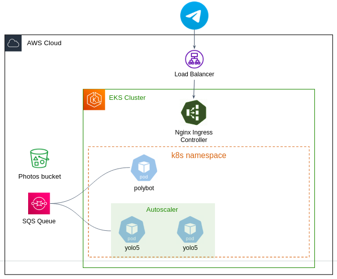

## Background

In this project you will deploy the Object Detection Service in a Kubernetes cluster on EKS.

## Preliminaries 

### Authentication

In this project we'll work on our **shared** k8s cluster: `k8s-main`. 

To work with the cluster, you first have to authenticate yourself. 

1. Open the Amazon EKS console at https://console.aws.amazon.com/eks/home#/clusters, Change region to `us-east-1` if needed.
2. Choose `k8s-main`.
3. Choose the **Access** tab.
4. Choose **Create access entry**.
5. For IAM principal, select your IAM role or user. 
6. For **Type**, accept the default (Standard). Choose **Next**.
7. On the **Add access policy** page, for **Policy name**, choose an access policy, an access scope, and click **Add policy**.
8. Choose **Next** and **Create**.

Configure your local `kubectl` cli to work against the cluster by updating the `kubeconfig` file:

```bash
aws eks --region us-east-1 update-kubeconfig --name k8s-main
```

Make sure you can list the cluster's pods:

```bash
kubectl get pods -A
```

### Create your own namespace

In order to peacefully share the same cluster together, each group will work on different **Kubernetes Namespace**. 

Kubernetes namespaces provide a way to logically partition and isolate resources within a cluster, allowing for better organization, access control, and resource management.

Create your own namespace in k8s:

```bash
kubectl create ns <your-ns>
```

Set `kubectl` to work by default against your namespace (otherwise you have to add `-n <your-ns>` on every `kubectl` command):

```bash
kubectl config set-context --current --namespace=<your-ns-alias>
```

### Access the kubernetes dashboard 

If you want a dashboard access, `port-forward` the dashboard service by:

```bash
kubectl port-forward -n kubernetes-dashboard service/kubernetes-dashboard 8081:8081
```

Then open your browser in `http://localhost:8081`. 

## Guidelines

Here is a high-level architecture of your service: 




#### Source code repo

Create a dedicated GitHub repo with the source code of the project. In the repo, create a directory called `k8s` in which you create the different YAML manifests. 

#### Docker images

Store your Docker images in either ECR or DockerHub.

#### `polybot` and `yolo5` manifests

Create YAML manifests for the `polybot` and `yolo5` microservices workloads.

Notes:

  - Configure liveness the readiness probes for your workloads. Create dedicated endpoints in the app code if needed.
  - Configure resources requests and limit. As this project is not a real product, try to reduce resources cost, CPU **request** must be **smaller** than `100m`, memory **request** must be **smaller** than `100Mi`. .  
  - The `yolo5` should be autoscalable (using `HPA`) by CPU utilization. Make sure the `yolo5` scales properly. 
  - The services should terminate gracefully. You should write some code that catches the `SIGTERM` send by the `kubelet` before the container is terminated (for example is case of rolling update), then stop the container work and terminate it with exit code 0.  


#### Telegram integration

Incoming traffic from Telegram servers into your cluster is done through the **Nginx ingress controller**. 

The ingress controller **is already deployed for you**, no need to deploy another one.

You only have to configure the `Ingress` object which routes traffic to your `polybot`. 

Your `Ingress` should perform the [TLS termination](https://kubernetes.github.io/ingress-nginx/examples/tls-termination/).
For that, you have to have a domain name for your bot. In AWS Route53, [create a subdomain alias record](https://docs.aws.amazon.com/apprunner/latest/dg/manage-custom-domains-route53.html) in our **shared registered domain** that resolve to the NLB assiciated with th Nginx ingress controller. In general, our domain should be `atech-bot.click`, but if you don't find it in Route53, ask your course staff.). 

For example: `my-nice-bot.atech-bot.click.com`. 

Use your bot domain as the Common Name when [generating the self-signed certificate](https://core.telegram.org/bots/webhooks#a-self-signed-certificate).


#### Service monitoring 

Deploy Grafana server **using Helm chart**, which persists data in a `2Gi` EBS disk. Integrate it with [AWS CloudWatch](https://grafana.com/docs/grafana/latest/datasources/aws-cloudwatch/) and build dashboard that display [metrics about your SQS queue](https://docs.aws.amazon.com/AWSSimpleQueueService/latest/SQSDeveloperGuide/sqs-available-cloudwatch-metrics.html).  

Feel free to add more panels to the dashboard. E.g. the status of your S3 bucket, metrics about your cluster's nodes, etc... 

### Notes 

- The cluster nodes have IAM role with permission on AWS. Feel free to add permission if needed. 
- Feel free to add nodes if you believe the cluster is full.


# Good Luck!