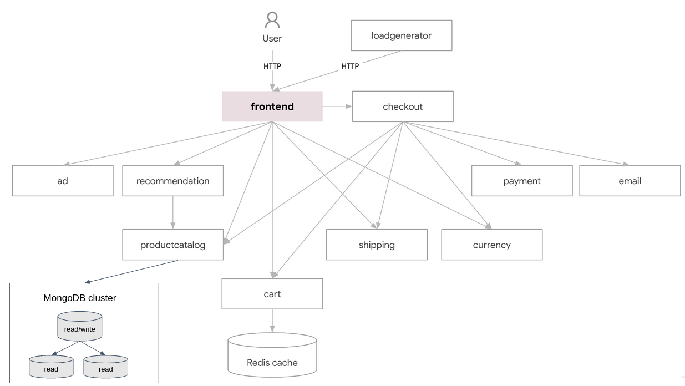

In this tutorial, we will deploy a MongoDB cluster, and integrate it with the `productcatalogservice` service (the service responsible for products catalog of the [Online Boutique](https://github.com/GoogleCloudPlatform/microservices-demo) app).

Currently, the `productcatalogservice` service stores products in a simple `products.json` file within the container. We want this service to dynamically read products from a MongoDB cluster, deployed in k8s.




The MongoDB cluster consists by 3 Pods: One primary replica and two secondary replicas.


## Deploy MongoDB as a StatefulSet

Due to the stateful nature of databases, we need a mechanism to store data in Kubernetes.
So far, Pods in the cluster were ephemeral resources, Pod's container state was not saved, so all of the files that were created or modified during the lifetime of the container are lost.

Kubernetes allows you to bind a [Persistent Volume](https://kubernetes.io/docs/concepts/storage/persistent-volumes/) to a Pod, so the data stored in that volume exist beyond the lifetime of a pod. 
An example for a persistent volume can be an external AWS EBS, Azure disks, or a "logical volume" that mounts a file or directory from the host node's filesystem into your Pod.

One more problem that arise here is the "identity" of Pods. 
The MongoDB cluster consists by 3 Pods, although all of them have the same container spec (based on the [mongo image](https://hub.docker.com/_/mongo)), one Pod is functioning as a **primary**, while the others are **secondaries** replicas. 

Obviously we cannot use Deployment here. In a Deployment, which manage an identical set of Pods, we can not prefer "this pod" over "that pod", each pod is interchangeable with any other pod. 
In the MongoDB case, we should know that "pod number 1" is the primary, while "pods 2 and 3" are secondaries replicas. 
In that sense, Pod has an "identity". 

Here **StatefulSet** comes in.

A [StatefulSet](https://kubernetes.io/docs/concepts/workloads/controllers/statefulset/) is the workload resource for **stateful** applications deployed in Kubernetes.
Similarly to Deployment, StatefulSet manages the deployment and scaling of a set of Pods, but provides **guarantees about the ordering and uniqueness of these Pods**.

Like a Deployment, a StatefulSet manages Pods that are based on an identical container spec. 
Unlike a Deployment, a StatefulSet maintains a **sticky identity** for each of its Pods. 

We'll explain these concepts on the below example. Here is a complete example to provision a MongoDB cluster:

```yaml
# k8s/mongo-statefulset.yaml

apiVersion: apps/v1
kind: StatefulSet
metadata:
  name: mongo
spec:
  serviceName: "mongo"
  replicas: 3
  selector:
    matchLabels:
      app: mongo
  template:
    metadata:
      labels:
        app: mongo
    spec:
      containers:
        - name: mongo
          image: mongo
          command:
            - mongod
            - "--replSet"
            - myReplicaSet
            - "--bind_ip_all"
          ports:
            - containerPort: 27017
          volumeMounts:
            - name: mongo-persistent-storage
              mountPath: /data/db
  volumeClaimTemplates:
  - metadata:
      name: mongo-persistent-storage
    spec:
      storageClassName: standard
      accessModes: [ "ReadWriteOnce" ]
      resources:
        requests:
          storage: 2Gi
---
apiVersion: v1
kind: Service
metadata:
  name: mongo-service
  labels:
    app: mongo
spec:
  clusterIP: None
  selector:
    app: mongo
  ports:
  - port: 27017
    targetPort: 27017
```

After applying the above manifest.

Now we need to initiate the mongo cluster. In order to do so, get a Mongo shell access to the first Pod of the StatefulSet, denoted by `mongo-0`.

```console
$ kubectl exec -ti mongo-0 -- mongosh
Current Mongosh Log ID:	654f5d7fbe499b77952befe7
Connecting to:		mongodb://127.0.0.1:27017/?directConnection=true&serverSelectionTimeoutMS=2000&appName=mongosh+2.0.1
Using MongoDB:		7.0.2
Using Mongosh:		2.0.1
...
```

From the opened Mongo Shell, initialize the Mongo cluster:

```javascript
rs.initiate({_id: "myReplicaSet", members: [{ _id: 0, host: "mongo-0.mongo-service" }, { _id: 1, host: "mongo-1.mongo-service" }, { _id: 2, host: "mongo-2.mongo-service" }]})
```

Then find which Pod has been assigned as primary:

```javascript
db.runCommand("ismaster")
```

The `primary:` entry indicate which Pod is your primary replica. 

```javascript
{
  // lines removed for clearer output
   
  hosts: [
    'mongo-0.mongo-service:27017',
    'mongo-1.mongo-service:27017',
    'mongo-2.mongo-service:27017'
  ],
  setName: 'myReplicaSet',
  primary: 'mongo-0.mongo-service:27017',
  me: 'mongo-2.mongo-service:27017',
  
  // lines removed for clearer output
}
```
