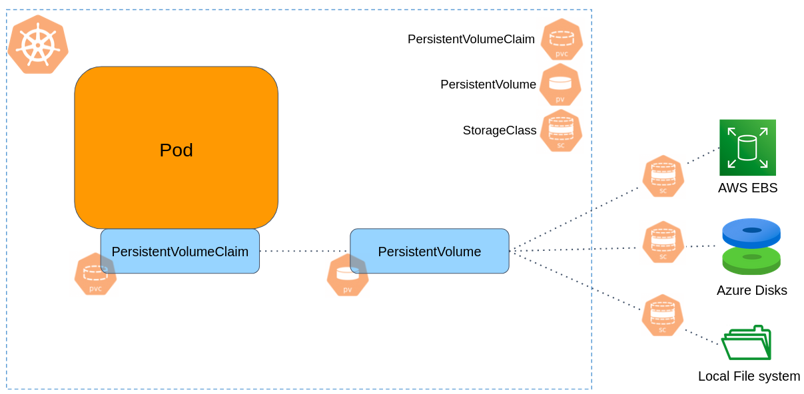

```console 
$ kubectl get pods -l app=mongo
NAME      READY   STATUS    RESTARTS   AGE
mongo-0   1/1     Running   0          12m
mongo-1   1/1     Running   0          12m
mongo-2   1/1     Running   0          12m
```

As can be seen, the StatefulSet assigns each Pod a unique, stable name of the form `<statefulset-name>-<ordinal-index>`, which results in Pods named `mongo-0`, `mongo-1`, and `mongo-2` (as opposed to Deployments, in which Pods got a random name). 

Each Pod in the Mongo cluster has its own persistent volume: 

```console
$ kubectl get persistentvolumeclaim
NAME                               STATUS   VOLUME                                     CAPACITY   ACCESS MODES   STORAGECLASS   AGE
mongo-persistent-storage-mongo-0   Bound    pvc-d45d676d-abff-4d0c-89ac-545a29f3d339   2Gi        RWO            standard       26m
mongo-persistent-storage-mongo-1   Bound    pvc-7b35b117-5ad4-433d-82a7-99968d89615c   2Gi        RWO            standard       26m
mongo-persistent-storage-mongo-2   Bound    pvc-0d5b76ce-e5aa-44a8-bc16-21070e0a5e45   2Gi        RWO            standard       26m
```

Let's introduce 3 important Kubernetes objects here:

- **PersistentVolume (PV)** is a piece of storage in the cluster.
  For example, the storage attached to the `mongo-0` Pod is `pvc-d45d676d-abff-4d0c-89ac-545a29f3d339`.
  In our case, this storage has been provisioned dynamically as part of the StatefulSet provisioning. This storage is of class `standard` (the default storage class of your Minikube cluster. We'll discuss it soon).

- **PersistentVolumeClaim (PVC)** is a **request** for storage. Pods can not use PersistentVolumes (PV) directly, instead, they do it by another object called PersistentVolumeClaim (PVC), which **claims** a PV. Pods are bound to PVC, which bound to PV resources.
- **Storage Class (SC)** provides a way to describe the "classes" of storage that the cluster can provision. Usually Kubernetes clusters have default storage class, but you can [create other storage classes](https://kubernetes.io/docs/concepts/storage/storage-classes/#the-storageclass-resource).
  The `StorageClass` object contains the fields `provisioner`, which determines volume driver used to create the actual storage. For example, `kubernetes.io/aws-ebs` is the provisioner to create AWS EBS volumes, or `kubernetes.io/azure-disk` to create disks in Azure. 
  Obviously, there should be a well-defined interface between the storage system of the cloud provider, and Kubernetes. The most commonly used interface today is the [Container Storage Interface (CSI)](https://github.com/container-storage-interface/spec).
  
  In Minikube clusters, the `standard` Storage Class has the `k8s.io/minikube-hostpath` provisioner, which mount a directory in the node's file system as a "storage". This Storage Class should be used for development only, it is not useful for real data persistence. 
  



In the `mongo` example above, the `VolumeClaimTemplate` entry defined in a StatefulSet creates a **PersistentVolumeClaim (PVC)** for each Pod. 
Then for each **PersistentVolumeClaim (PVC)**, a single **PersistentVolume** is created with a **StorageClass** of `standard` and 2 GiB of provisioned storage.
When a Pod is (re)scheduled onto a node, for example as a result of a rolling update, its knows the PersistentVolumes associated with it. That way Pods can be failed or replaced, and returned to the same volume the previous Pod has.
In our example, Pod `mongo-0` will always be mounted to `pvc-d45d676d-abff-4d0c-89ac-545a29f3d339` volume.


> [!NOTE]
> The actual volumes have been created dynamically when the StatefulSet object was created. This is known as **dynamic provisioning**. 
> Without dynamic provisioning, cluster administrators have to manually make calls to their cloud or storage provider to create new storage volumes, and then create PersistentVolume and PersistentVolumeClaim objects to represent them in Kubernetes.
> In the tutorial exercises below there is an exercise to create storage objects manually. 

What else should we say about the `mongo` StatefulSet? 

Pods also have a **stable network identity**. 
For example, let's say the Mongo primary replica is `mongo-0` (the primary is the only member in the replica set that receives write operations),
accessing the DB from another application in the cluster is simply done by `mongo-0.mongo-service`. 
The domain takes the form: `<pod-name>.<service-name>`.

Note that the `mongo-service` Service created for the StatefulSet, has an entry `ClusterIP: none`. This is known as a [Headless Service](https://kubernetes.io/docs/concepts/services-networking/service/#headless-services). 
**Headless Service** doesn't have Cluster IP and no load-balancing mechanism for the different Pods, instead, it is used for **discovery mechanisms**.
When resolving the DNS name `mongo-service`, you don't get an IP address of **one** of the Pods this service is pointing to (as done in a regular service), but you get the IP addresses of **all** the Pods this service is pointing to. 

```bash 
kubectl run -i --tty --rm headless-test --image=alpine --restart=Never -- nslookup mongo-service
```

Since in StatefulSet each Pod has an "identity", there is no any meaning to load balancing the traffic evenly across different Pods.
We use the Service just to group the Pods together under domain name, but the actual communication is done with particular Pod. 
In our case, if you want to perform read/write to the MongoDB, talk with `mongo-0.mongo-service`, if you want to read only, talk with either `mongo-1.mongo-service`, or `mongo-2.mongo-service`.


## Deployment and Scaling Guarantees in StatefulSet

When the `mongo` example above is created, three Pods will be deployed **in the order**: `mongo-0`, `mongo-1`, `mongo-2`.
`mongo-1` will not be deployed before `mongo-0` is **Running** and **Ready**, the same goes for `mongo-2`. 

If you were to scale the StatefulSet such that `replicas=1` (only 1 replica of Mongo), `mongo-2` would be terminated first, then `mongo-1`.
`mongo-1` would not be terminated until `mongo-2` is fully shutdown and deleted.

A StatefulSet's `.spec.updateStrategy` field allows you to configure and disable automated rolling updates.
When a StatefulSet's `.spec.updateStrategy.type` is set to `RollingUpdate`, the StatefulSet will delete and recreate each Pod in the StatefulSet.
It will proceed in the same order as Pod termination (from the largest ordinal to the smallest), updating each Pod one at a time.

