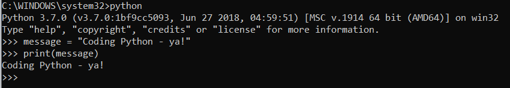
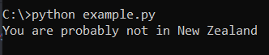

Once you've installed Python, you'll want to write some code and run (execute) it. There are two main ways to run Python code:

- Directly in the command line
- Executing a Python file


## Directly in the Command Line

When you type python in the command line, you enter what's known as an **interactive python shell** - this allows you to execute Python commands directly in the command line, and see their result directly beneath.

One of the most basic commands we have is the print command which we use to output some information:



There are two commands in the above image:
- `message = "Coding Python - ya!"`
- `print(message)`

You'll notice that there is no "output" for the first command - that's because not all Python commands have an output.

The second command - the print - does have an output, which we see on the following line.

Writing code like this is useful for testing/executing short commands, but not practical when we want to write scripts or applications.

To get out of this interactive shell, you can use the `exit()` command.


## Executing a Python File

The more common way to write Python is in a file with an extension of `.py`

For example, go to your Desktop and create an example.py file, open it in a code editor of your choice.


we will be using the VSCode editor (which you should have installed already)

Open your editor and add the following code:

```python
number_of_sheep = 200
  if number_of_sheep > 1000:
    print("You are in New Zealand, probably")
  else:
    print("You are probably not in New Zealand") 
```


To execute the code, you'll have to navigate to your Desktop (or wherever you created the file) in your terminal, and execute the command python `example.py`

If you've done it right, this is what you should see in your terminal:



So even though the command python `example.py` will execute each line in the file, the command line will only show output(s) that we tell it to.


That's it for setup - time to start coding!