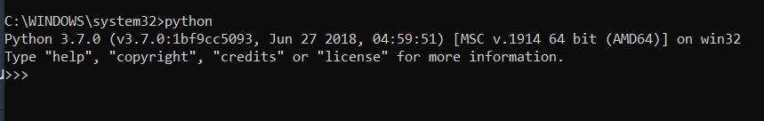

In order to install Python, you can go to [Python's Official Site](https://www.python.org/downloads/) - it should give you an option to download a version of Python compatible with your machine (Mac/Windows/Linux).

In our course we will be using **Python 3.7**, so make sure you download the correct version.

Once your download completes, you'll have to install it (should be a short process).

Important note:

During the installation, mark `Add Python to PATH` option:

When you've finished the install, if you've done it correctly, you should be able to open up a new terminal/command prompt, and execute the python command to see something like this, though hopefully your version is greater than 3.7.0:

If you see that - congratulations! You've successfully installed Python 🐍

