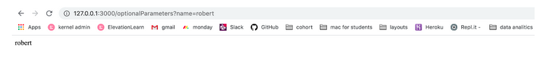

Right now these routes are just returning simple strings (i.e. data), but soon we'll see how to return entire ```files/directories/json``` - and then each route will be more meaningful.
Sometimes we need to send information from the client to the server when we make requests. For instance: we might want to send the user a custom welcome message depending on which user has come to our site.

To that end, check out this code:

```
@app.route('/landing/<username>')
def greet_user(username):
  return Response("Hi there {}".format(username))
```
 

**A few things**:
We're using the `username` parameter that we defined as a `greet_user` parameter to access part of the route.
We can access this route by going to `localhost:3000/landing/Tilda`, for example - though the name is variable!
The `/<username>` is just a placeholder for anything that comes after `/landing`
Any part of the route that contains `<>` will be a variable that has to come in through the route

Parameters that are part of the route (like `/<userID>` or `<username>` from above) are required parameters. If you got to `/users/<userID>` without supplying a `userID`, it will not work.

However, we can also accept optional parameters.

APIs tend to work like this too. For instance, when we access the Google Books API, we send a request that looks like this: 
```
googleapis.com/books/v1/volumes?q=title:the alchemist
```
If you recall, the part in bold is called a query string - this is where we can send the optional parameters. Check this out:

```
from flask import Flask, Response, request

@app.route('/optionalParameters')
def query_params():
	name = request.args.get('name')
	return Response(name)
```


Notice that this route doesn't have anything after the route name. Not required `/<parameters>`

However, we are accessing `request.args` - the `args` key is a dictionary where our optional parameters will be stored. This is why we can access any property in the dictionary using the builtin get method.
For instance, if we (save, restart server) go to 
```
localhost:3000/optionalParameters?name=robert, we should see this:
```



To send the parameters, as you can see, we add a `/?{KEY}={VALUE}` pair after the route itself.

And of course, we can add as many parameters as we want in our route. We just need to separate each key-value pair with an ampersand: `&`
like this: 
```
localhost:3000/optionalParameters?name=robert&age=33
```

**Note:** the above is a silly example where the server responds with the same data it was given - this is just to underscore the point that we can access the query string using `request.args`

It is important to notice that if we want to return all the parameters we can not return the python dictionary. Instead, we will use a much more common format for passing data through HTTP requests - **JSON**.

