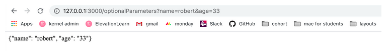

Luckily, python has a builtin json library, so all we need to do is to import it and use the dumps method that will parse the python dictionary into a stringified json and return it.

```
import json

@app.route('/optionalParameters')
def query_params():
	json_string = json.dumps(request.args)
	return Response(json_string)
```


And this how it will look like in the browser:



