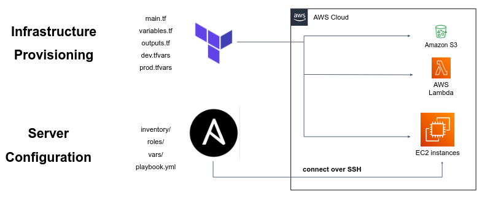

Ansible is an open-source automation tool that simplifies the process of configuring and managing remote servers.

Main features:

- Declarative language described in YAMLs.
- Automate repetitive tasks such as software installation, configuration management, and application deployment across multiple servers or workstations.
- Works over SSH, allowing it to manage both Linux and Windows machines.
- Large and active community.
- Ships with a [comprehensive documentation](https://docs.ansible.com/ansible/latest/getting_started/index.html#getting-started-with-ansible). 

## Installation

https://docs.ansible.com/ansible/latest/installation_guide/intro_installation.html#installing-ansible

**Note**: While Ansible as a tool can connect and manage remote Windows servers, installing and using Ansible **from** Windows is not supported, only Linux here. 

## Choosing the right tool (Terraform vs Ansible)

