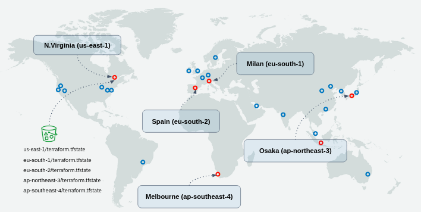

## Background 

This project focuses on provisioning your Object Detection Service in AWS using Terraform. 

You'll achieve exactly the same service as in the AWS project, but provisioned with Terraform's infrastructure as code approach.
In addition, you would be able to provision and destroy the service in different AWS regions with just a few clicks(!). This makes your service ready for [disaster recovery](https://cloud.google.com/learn/what-is-disaster-recovery) scenarios. 

## Guidelines

### Configuration files structure and usage

Here is a general structure for the Terraform root module directory:

```text
tf/
├── polybot                         # Module for polybot resources
│   ├── main.tf
│   ├── variables.tf
│   └── outputs.tf
├── yolo5                           # Module for yolo5 resources
│   ├── main.tf
│   ├── variables.tf
│   └── outputs.tf
├── main.tf
├── outputs.tf
├── variables.tf
├── region.us-east-1.tfvars         # Values related for us-east-1 region
└── region.eu-central-1.tfvars      # Values related for eu-central-1 region
```

Once your project is completed, you should use it as follows:

1. Select the workspace in which you want to provision the infrastructure:

```bash
terraform workspace select us-east-1
```

2. Provision the service in the region using the corresponding `tfvars` file.

```bash
terraform apply -var-file=region.us-east-1.tfvars -var="botToken=$US_EAST_1_TOKEN_VALUE"
```

Wait for the service until it's operational...

3. When done, **destroy all resources to avoid unnecessary costs**.

```bash
terraform destroy -var-file=region.us-east-1.tfvars
```

### General notes

- The `polybot` and `yolo5` service should be configured as separate Terraform modules. 
- Since Terraform can provision and destroy the same infrastructure consistently, you don't need to keep your AWS resources existed for long time. **Ensure that your resources are destroyed at the end to minimize costs.**
- Don't store sensitive data in the `.tf` or `.tfvars` files.
- Feel free to use other Terraform modules (e.g. for VPC).

### Using Terraform workspace to manage state across multiple regions 

In this project, you apply the same configuration files for multiple AWS regions. 
Obviously, each region should have a separate `tfstate` file, storing state data.

The below image demonstrates the Object Detection Service deployed in 5 different regions.
Each region has its own Telegram bot token, but resource-wise, the regions are identical.
The `tfstate` files of all regions are stored in the same S3 bucket, located in one of the regions (`us-east-1` in this case). 




[Terraform workspaces](https://developer.hashicorp.com/terraform/cli/workspaces) can help you to easily manage multiple sets of resources, originated from the same `.tf` configuration files.

All you have to do it to create a workspace per region. For example: 

```bash
terraform workspace new us-east-1
```

And once you want to apply the configuration in `us-east-1`, perform:

```bash
terraform workspace select us-east-1
terraform apply .....
```

That's all. No need to do something spacial with the S3 bucket, just configure a regular [S3 backend](https://developer.hashicorp.com/terraform/language/settings/backends/s3), and state files of all different workspaces will be stored there automatically. 


### Applying region-specific values per region 

The `region.REGION_CODE.tfvars` files (and only them!) contain region-related values.
As mentioned above, once you want to apply the configuration for a given region, provide the corresponding `.tfvars` in the `terraform apply` command:

```bash
terraform apply -var-file=region.us-east-1.tfvars .... 
```

All your `.tf` configuration files should be region-agnostic, which means, you have to avoid hardcoding specific region-related settings, such as AMIs.

Make sure that **all service's resources are managed by Terraform**. Specifically, don't create a dedicated AMI containing the application code and dependencies, as done in the AWS project (Why?).
Instead, deploy the application on a fresh EC2 Ubuntu instance using the methods outlined in the **App Bootstrapping** section below.

The only step that you can do **manually** is to create a subdomain in our shared domain in Route53, and point it to your load balancer (Terraform can automate it, but we want to prevent accidental domain deletion).

You can create `.tfvars` files for **2 different regions only**.
Generalize it to more regions should be as simple as creating the corresponding `.tfvars` file for the region, as well as generating a new Telegram token. 

### Bootstrapping the app in your EC2 instances

You should use your Docker images stored in Dockerhub or ECR.
Once you provisioned an EC2 (e.g. for the polybot service), you have to run the application in it. 
Use [User Data](https://registry.terraform.io/providers/hashicorp/aws/latest/docs/resources/instance#user_data), [remote-exec Provisioner](https://developer.hashicorp.com/terraform/language/resources/provisioners/remote-exec), AWS Lambdas, or any other method to bootstrap the app in your instances.

Except the manual step mentioned above, you should not do any manual step to make the service up and running. 

### Getting started template

Here is a good starting point:

```terraform
# tf/main.tf

terraform {
  required_providers {
    aws = {
      source  = "hashicorp/aws"
      version = ">=5.0"
    }
  }
  
  backend "s3" {
    bucket = "YOUR_TFSTATE_BUCKET"
    key    = "path/to/my/key"
    region = "us-east-1"
  }

  required_version = ">= 1.7.0"
}

provider "aws" {
  region  = var.region
}
```

# Good Luck
