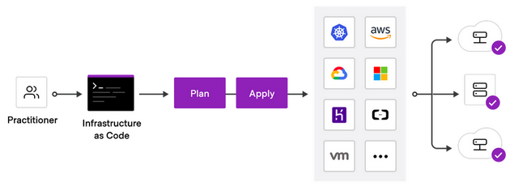

**HashiCorp Terraform** is an infrastructure as code (IaC) tool that lets you define cloud resources in human-readable configuration files that you can version, reuse, and share.





Want to create an EC2 instance for 3 environments (dev, test, prod), or in 15 regions? You can't really do it using the web console...
Using Terraform, it's as simple as configure the below code in a `.tf` file: 

```terraform
resource "aws_instance" "app_server" {
  ami           = "ami-0123456789abcdef0"
  instance_type = "t2.micro"

  tags = {
    Name = "some-instance"
    Terraform = "true"
  }
}
```

And perform the `terraform apply` command. 


Terraform creates and manages resources on cloud platforms through their APIs.
Providers enable Terraform to work with virtually any platform or service with an accessible API.

HashiCorp and the Terraform community have already written more than 1700 providers to manage thousands of different types of resources and services.

You can find all publicly available providers on the [Terraform Registry](https://registry.terraform.io/browse/providers), including AWS, Azure, GCP, Kubernetes, Helm, GitHub, Splunk, DataDog, and many more.

## IaC Benefits

- **Automated Provisioning**: Automates the creation and configuration of infrastructure, less human errors.
- **Consistent Environments**: Ensures uniformity across development, testing, and production environments.
- **Repeatable Process**: Allows for the replication of infrastructure setups, or reproduced infrastructure in a case of Disaster Recovery (RD).
- **Versioned and Documented**: IaC scripts are version-controlled, enabling teams to track changes over time and roll back to previous states if needed. 


## Install Terraform

https://learn.hashicorp.com/tutorials/terraform/install-cli?in=terraform/aws-get-started
