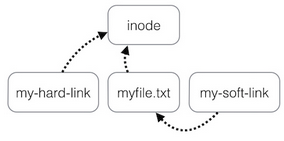

A link is nothing more than a way of matching two or more file names to the same set of file data.

**Hard link** associates two or more file names with the same inode. Hard links share the same data blocks on the hard disk, while they continue to behave as independent files.
**Soft link** or symbolic link (sometimes pronounced "symlink") is a small file that is a pointer to another file.

Use the `ln` command to create a hard/soft link:
```bash
myuser@hostname:~$ touch myfile.txt
myuser@hostname:~$ ln myfile.txt my-hard-link 
myuser@hostname:~$ ln -s myfile.txt my-soft-link
```