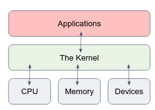

### Exercise 1 - Know Your System
Change directory to `/proc`.
1. What CPU(s) is the system running on?
1. How much RAM does it currently use?
1. How much swap space do you have?
1. What drivers are loaded?
1. How many hours has the system been running?
1. Which filesystems are known by your system?

  Change to `/etc`

1. How long does the system keep the log file in which user logins are monitored?
1. How many users are defined on your system? Don't count them, let the computer do it for you using wc!
1. How many groups do you have?
1. Which version of bash is installed on this system?
1. Where is the time zone information kept?

<details>
  <summary>
    Solution
  </summary>

```bash
myuser@hostname:~$ cd /proc

# a solution 
myuser@hostname:/proc$ cat cpuinfo

# b solution 
myuser@hostname:/proc$ cat meminfo

# c solution 
myuser@hostname:/proc$ cat swaps

# d solution 
myuser@hostname:/proc$ cat modules

# e solution 
myuser@hostname:/proc$ cat uptime

# f solution 
myuser@hostname:/proc$ cat filesystems

myuser@hostname:/proc$ cd /etc

# g solution 
myuser@hostname:/etc$ cat logrotate.conf

# h solution 
myuser@hostname:/etc$ cat passwd | wc -l

# i solution 
myuser@hostname:/etc$ cat group

# j solution 
myuser@hostname:/etc$ bash --version

# k solution 
myuser@hostname:/etc$ ls -l localtime
```
</details>

### Exercise 2 - Binary Numbers
1. Convert the following binary numbers to decimals: 111, 100, 10110.
1. What is the available decimal range represented by an 8 bits binary number?
1. Given a 9 bits binary number, suggest a method to represent negative numbers between 0-255.
1. Suggest a method to represent floating point numbers (e.g. 12.3,  15.67, 0.231) using 8 bits binary numbers.

<details>
  <summary>
    Solution
  </summary>

1. To convert a binary number to decimal, you can use the following method: Starting from the rightmost digit of the binary number, multiply each digit by two to the power of its position, counting from 0 for the rightmost digit. Then, sum the results of these multiplications to obtain the decimal equivalent of the binary number.
For example:
   - 111 in binary is equal to: 1 * 2^2 + 1 * 2^1 + 1 * 2^0 = 4 + 2 + 1 = 7 in decimal.
   - 100 in binary is equal to: 1 * 2^2 + 0 * 2^1 + 0 * 2^0 = 4 + 0 + 0 = 4 in decimal.
   - 10110 in binary is equal to: 1 * 2^4 + 0 * 2^3 + 1 * 2^2 + 1 * 2^1 + 0 * 2^0 = 16 + 0 + 4 + 2 + 0 = 22 in decimal.
1. An 8-bit binary number can represent a range of decimal numbers from 0 to 255 (2^8 - 1). This is because there are 8 digits (or bits) in the binary number, and each digit can have one of two possible values (0 or 1), giving a total of 2^8 (256) possible combinations of digits.
1. One common method for representing negative numbers is using the leftmost bit to represent the sign - 0 for positive, 1 for negative. 
1. First 4 bits for the integer part and the rest 4 bits for the fractional part.
</details>

### Exercise 3 - Kernel System Calls
The Linux Kernel was presented in our first linux lecture - the main component of a Linux OS which functions as the core interface between a computer’s hardware and its applications.


Then we moved to learn how to use the Terminal and communicate with the OS using commands such as `ls` or `chmod`.

But how does it really work? We type a command and hit the Enter key, then what happens? This question tries to investigate this point.

Under the hood, linux commands are compiled C code (get to know what a compilation process is if you don’t know…). The C code contains **system calls**. The system call is the fundamental interface between an application and the Linux kernel.

In simple words, when your application wants to use the hardware (e.g. calculate something in the CPU, or write data to the disk), you create a system call to the Linux Kernel, and the linux kernel talks with the hardware on your behalf. Read more about what System Calls are.

`strace` is a Linux command, which traces system calls and signals of a program. It is an important tool to debug your programs in advanced cases. In this assignment, you should follow the `strace` output of a program in order to understand what exactly it does (i.e. what are the system calls of the program to the kernel). You can assume that the program does only what you can see by using `strace`.

To run the program, open a linux terminal in an empty directory and copy the file `strace_ex/whatIdo` from our shared repository, to your current working directory. :
1. Give the `whatIdo` file an exec permission (make sure you don’t get Permission denied when running it).
1. Run the program using strace: `strace ./whatIdo.`
1. Follow strace output. Tip: many lines in the beginning are part of the load of the
1. program. The first “interesting” line comes only at the end of the output.
1. Try to get a general idea of what this program does by observing the sys calls and the directory you’ve run the program.

<details>
  <summary>
    Solution
  </summary>

The program creates a directory called `welcomeToDevOpsBootcampElevation`. Under this directory, the program creates the file `goodLuck` and writes “There you go… tell me what I do…” in it.
</details>