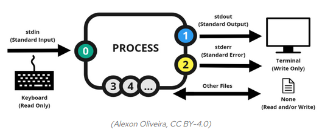

How does it work? IO redirection reveals a very interesting structure for Linux systems.

Most Linux commands read input, such as a filename, and write output to the screen. By default, your keyboard is represented in linux by the standard input (**stdin**) device, and the screen or a particular terminal window is represented by the standard output (**stdout**) device. We already said that in linux everything is a file, and indeed, you can find the stdin and stdout files in the `/dev` directory.
```bash
myuser@hostname:~$ ls -l /dev
...
lrwxrwxrwx 1 root root          15 Mar  7 16:45 stderr -> /proc/self/fd/2
lrwxrwxrwx 1 root root          15 Mar  7 16:45 stdin -> /proc/self/fd/0
lrwxrwxrwx 1 root root          15 Mar  7 16:45 stdout -> /proc/self/fd/1
...
```
Or even better:
```bash
myuser@hostname:~$ ls -l /dev | grep "stdin\|stdout"
lrwxrwxrwx 1 root root          15 Mar  7 16:45 stdin -> /proc/self/fd/0
lrwxrwxrwx 1 root root          15 Mar  7 16:45 stdout -> /proc/self/fd/1
```
In the above `ls -l /dev` command, instead of printing the output to the screen (to stdout, as we used to see), the output is redirected **as an input** to the next command, to `grep`. Again, instead of writing the output of the left side of the pipe to the standard output, this output is redirected to the standard input of the command grep. So `grep` is searching and filtering on the output of the ls command. In this example we are filtering lines containing the text `stdin` or `stdout`, we do it by the `stdin\|stdout` regular expressions.