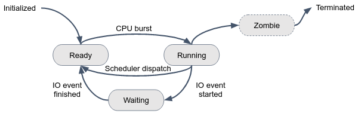

In linux, multiple users run multiple processes, at the same time and on the same system. The CPU manages all these processes simultaneously, according to the below state diagram:

A process can be in one of several states at any given time, indicating its current status or activity. These states are important to understand for managing and troubleshooting system performance.

Here is a short description of each state:
1. **Running**: A process is currently executing on a CPU core (a.k.a process CPU burst).
1. **Waiting**: A process is waiting for some external event, such as user input, disk, or a network I/O operation to complete.
1. **Ready**: Is often used to refer to a process that is waiting to be executed on a CPU. When a process is in the ready state, it is typically placed in a queue, waiting for an available CPU to execute on. Once the CPU becomes available, the process is moved from the ready state to the running state and starts executing. The amount of time a process spends in the ready state is dependent on the scheduling algorithm and the current system load. 
1. **Zombie**: A process has completed its execution but its parent process has not yet collected its exit status.
1. **Initialized**: A process that has been created but has not yet been assigned a process identifier (PID) 
1. **Terminated**: Indicates that a process has finished its execution and has exited.