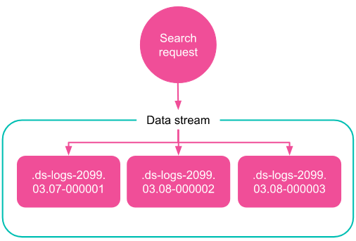

### Documents and indices

Elasticsearch stores JSON [**documents** in an **index**](https://www.elastic.co/guide/en/elasticsearch/reference/current/documents-indices.html).
You can efficiently search documents in your index, filter them by timestamp or any other condition. 
You can also aggregate some values in your documents, for example, to sum some value across a group of documents.  

In our context, Elasticsearch will be used to store application logs data.
Each log entry represented as a JSON document and stored in an index. E.g.: 

```json
{
  "agent": "Mozilla/5.0 (X11; Linux i686) AppleWebKit/534.24 (KHTML, like Gecko) Chrome/11.0.696.50 Safari/534.24",
  "bytes": 1538,
  "clientip": "37.68.248.33",
  "geo": {
    "srcdest": "US:US",
    "src": "US",
    "dest": "US",
    "coordinates": {
      "lat": 65.83049389,
      "lon": -144.0758128
    }
  },
  "host": "cdn.elastic-elastic-elastic.org",
  "index": "kibana_sample_data_logs",
  "ip": "37.68.248.33",
  "machine": {
    "ram": 12884901888,
    "os": "win xp"
  },
  "message": "37.68.248.33 - - [2018-09-18T05:33:31.512Z] \"GET /styles/app.css HTTP/1.1\" 200 1538 \"-\" \"Mozilla/5.0 (X11; Linux i686) AppleWebKit/534.24 (KHTML, like Gecko) Chrome/11.0.696.50 Safari/534.24\"",
  "referer": "http://twitter.com/success/l-opold-eyharts",
  "request": "/styles/app.css",
  "response": 200,
  "tags": [
    "warning",
    "info"
  ],
  "@timestamp": "2024-03-05T05:33:31.512Z",
  "url": "https://cdn.elastic-elastic-elastic.org/styles/app.css",
  "utc_time": "2024-03-05T05:33:31.512Z",
  "bytes_gauge": 1538,
  "bytes_counter": 76948722
}
```

As can be seen, these logs may include crucial information such as timestamp, log level, user interactions, and error messages.

### Data streams 

How long should we store logs data? Usually logs data is stored for 30, 60, 90 days... depending on the context. But even if our index contains billions of logs documents from the last 30 days, that can badly affect searching time. 
For example, we can create an index per day, containing only the logs for that day. That way we improve search performance.
But now we have to work with many different indices in case we want to query or aggregate data across multiple days.. 

**Data streams** can be used to automatically divide our documents into a set of indices, while giving you a single named resource for requests.





A data stream consists of one or more hidden, auto-generated backing indices.
You can submit indexing and search requests directly to a data stream. The stream automatically routes the request to backing indices that store the stream’s data.

Every document indexed to a data stream must contain a `@timestamp` field, this kind of data model is call [Time series](https://en.wikipedia.org/wiki/Time_series).

1. Open Kibana main menu, under **Management**, choose **Stack Management**.
2. In the Management pane, under **Data**, choose **Index Management**.
3. Choose the **Data Streams** tab and take a look on the `kibana_sample_data_logs` data stream that was created for you when added the sample logs data. 
4. Choose the **Indices** tab, enable the **Include hidden indices** toggle, type `sample_data_logs` in the search field to filter the underlying index upon which the `kibana_sample_data_logs` is based. 

### Data view

In order to work with the data in Kibana, you have to create a **Data View**. Data view, as it sounds, is a "view" on your data stored in Elastic. 

A Data view can point to one or more indices, data streams, or index.
For example, a Data view can point to your log data from yesterday, or all indices that contain your data.

1. In the **Stack Management** page, under **Kibana**, choose **Data Views**.
2. Validate that the **Kibana Sample Data Logs** data view is based on the `kibana_sample_data_logs` data stream. 

