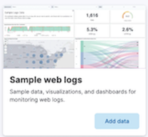

You can install [Elastic](https://www.elastic.co/guide/en/elasticsearch/reference/current/install-elasticsearch.html) and [Kibana](https://www.elastic.co/guide/en/kibana/current/install.html) in any way you like. 

Assuming you know how to work with Docker containers, to start a single-node Elastic instance and a Kibana server follow the official docs:

https://www.elastic.co/guide/en/elasticsearch/reference/current/docker.html

> [!IMPORTANT]
> - Make your Elastic instance persistent by adding the `-v elasticdata01:/usr/share/elasticsearch/data` flag.  
> - Make your Kibana instance persistent, add the `-v kibanadata:/usr/share/kibana/data` flag to create and mount a Docker volume on the host machine.  

> [!NOTE]
> - If the Elastic container stops with exit code 78, perform `sudo sysctl -w vm.max_map_count=262144` (read [Set vm.max_map_count to at least 262144](https://www.elastic.co/guide/en/elasticsearch/reference/current/docker.html#_set_vm_max_map_count_to_at_least_262144) in the above installation docs).
> - No need to run more than a single Elastic node.
> - You can also deploy Elastic in a Kubernetes cluster using the [ECK operator](https://www.elastic.co/guide/en/cloud-on-k8s/current/k8s-deploy-eck.html. 

After installation, access your Kibana server as detailed in the docs.

The welcome page in Kibana may suggest you to add integrations from which Kibana can collect data to monitor and analyse, choose **Explore on my own**,

Now let's add sample data with which we'll be experimenting during the tutorial. 

1. On the home page, click **Try sample data**.
2. Click **Other sample data sets**.
3. On the **Sample web logs** card, click **Add data**.

In the elastic main menu, **Discover** displays the data in an interactive histogram that shows the distribution of data over time, and a table that lists the available fields.
The **Dashboard** displays a collection of panels that visualizing the data.

Take a look on the data as displayed in the Discover page, and on a nice dashboard visualizing this data. 

