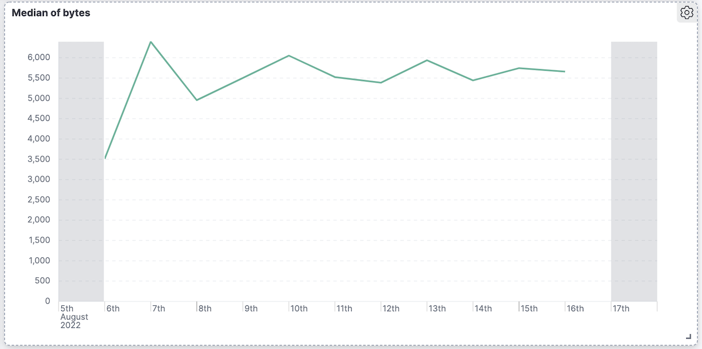
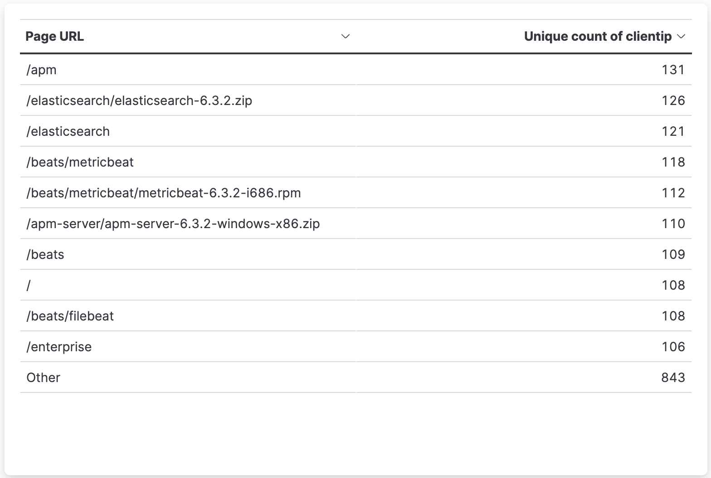
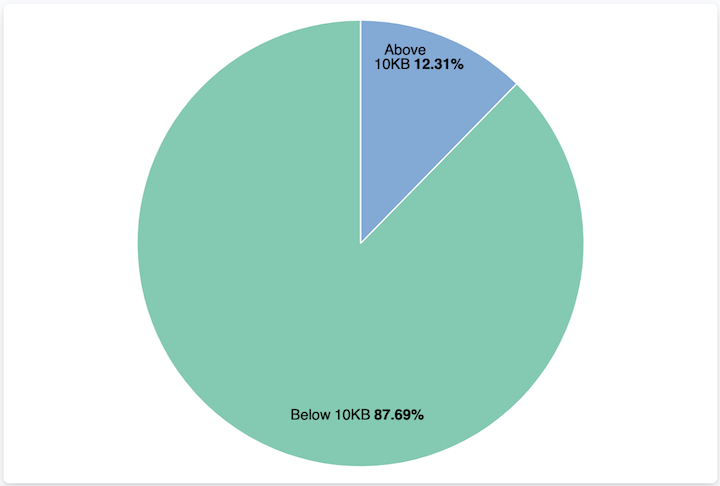

The best way to understand your data is to visualize it.
With dashboards, you can turn your data from one or more data views into a collection of panels.

### Create a new dashboard

1. Open the main menu, then click **Dashboard**.
1. Click **Create dashboard**.
1. Set the time filter to **Last 7 days**.
1. On the dashboard, click **Create visualization**.
1. Make sure the **Kibana Sample Data Logs** Data view appears.

### Panel I: Unique visitors

1. Open the **Visualization type** dropdown, then select **Metric**.
1. From the **Available fields** list, drag `clientip` to the workspace or layer pane.
1. In the layer pane (the right bar menu), click **Unique count of clientip**.
1. Under **Appearance**, in the **Name** field, enter `Unique visitors`.
1. Click **Close**.
1. Click **Save** to save the panel.


### Panel II: Outbound traffic over time

To visualize the **bytes** field over time:

1. On the dashboard, click **Create visualization**.
1. From the **Available fields** list, drag `bytes` to the workspace.

The visualization editor creates a bar chart with the **timestamp** and **Median of bytes** fields.

1. To emphasize the change in **Median of bytes** over time, change the visualization type to **Line**.
1. The default minimum time interval is 3 hour, but we would like to get a view over days. To increase the minimum time interval:
    1. In the layer pane, click **timestamp**.
    1. Change the **Minimum interval** to **1d**, then click **Close**.

1. Click **Save and return**




### Panel III: Top requested pages

We will create a visualization that displays the most frequent values of `request.keyword` on your website, ranked by the unique visitors.

1. On the dashboard, click **Create visualization**.
1. From the **Available fields** list, drag **clientip** to the **Vertical axis** field in the layer pane.

The visualization editor automatically applies the **Unique count** function.

1. Drag **request.keyword** to the workspace.

Note: The chart labels are unable to display because the **request.keyword** field contains long text fields

1. Open the **Visualization type** dropdown, then select **Table**.
1. In the layer pane, click **Top 5 values of request.keyword**.
1. In the **Number of values** field, enter `10`.
1. In the **Name** field, enter `Page URL`.
1. Click **Close**.
1. Click **Save and return**.




### Panel IV: Classify request size

Let's create a proportional visualization that helps you determine if your users transfer more bytes from requests under 10KB versus over 10Kb.

1. On the dashboard, click **Create visualization**.
1. From the **Available fields** list, drag **bytes** to the **Vertical axis** field in the layer pane.
1. In the layer pane, click **Median of bytes**.
1. Click the **Sum** quick function, then click **Close**.
1. From the **Available fields** list, drag **bytes** to the **Breakdown by** field in the layer pane.
1. In the **Breakdown** layer pane, click **bytes**.
1. Click **Create custom ranges**, enter the following in the **Ranges** field, then press Return:
    1. **Ranges** &mdash; `0` -> `10240`
    1. **Label** &mdash; `Below 10KB`

1. Click **Add range**, enter the following, then press Return:
    1. **Ranges** &mdash; `10240` -> `+∞`
    1. **Label** &mdash; `Above 10KB`

1. From the **Value format** dropdown, select **Bytes (1024)**, then click **Close**.

To display the values as a percentage of the sum of all values, use the **Pie** chart.

1. Open the **Visualization Type** dropdown, then select **Pie**.
1. Click **Save and return**.




### Panel V: Distribution of requests along the day

Create the following visualization:


### Panel VII: Website traffic sources

Let's create a proportion table that breaks down the data by website traffic from twitter.com, facebook.com, and other.

1. On the dashboard, click **Create visualization**.
1. Open the **Visualization type** dropdown, then select **Treemap**.
1. From the **Available fields** list, drag **Records** to the **Size by** field in the layer pane.
1. In the layer pane, click **Add or drag-and-drop a field** for **Group by**.

Create a filter for each website traffic source:

1. Click **Filters**.
1. Click **All records**, enter the following in the query bar, then press Return:
    1. **KQL** - `referer : *facebook.com*`
    1. **Label** - `Facebook`

1. Click **Add a filter**, enter the following in the query bar, then press Return:
    1. **KQL** - `referer : *twitter.com*`
    1. **Label** - `Twitter`

1. Click **Add a filter**, enter the following in the query bar, then press Return:
    1. **KQL** - `NOT referer : *twitter.com* OR NOT referer: *facebook.com*`
    1. **Label** - `Other`

1. Click **Close**.
1. Click **Save and return**.

### Panel VI: SLA (Service-level agreement)

Assume Facebook and Twitter are your two major customers, and your company agreed to serve 99% of the incoming requests originating from Facebook or Twitter.

Create a visualization which calculates the SLA per client over a single day.
The SLA is defined by the following formula:

```text
1 - [(# of failed requests)/(# of total requests)]
```

Failed requests are those with status code `>= 500`.


Tip - use thew following custom formula:

```text
1 - (count(kql='response.keyword >= 500') / count(kql='response.keyword: *'))
```
