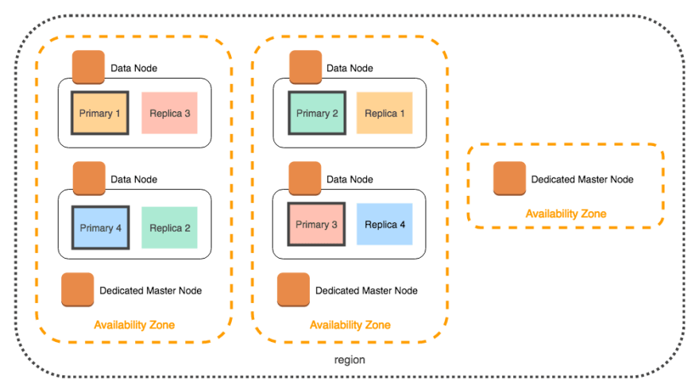

How can Elasticsearch support incredibly fast search capabilities in an unstructured data? Indexing. 

When a document is stored, it is indexed and fully searchable in near real-time.
Elasticsearch uses a data structure called an **inverted index** that supports very fast full-text searches. How?

An inverted index lists every unique word that appears in any document and identifies all of the documents each word occurs in:


By default, Elasticsearch indexes **all data in every field**, each indexed field has a dedicated, optimized data structure.
We've just mentioned that text fields are stored in inverted indices, but numeric and geo fields, for example, are stored in unique data structure called [BKD trees](https://en.wikipedia.org/wiki/K-D-B-tree). 

It's often useful to index the same field in different ways for different purposes.
For example, you might want to index a string field as both a `text` field for full-text search and as a `keyword` field for sorting or aggregating your data. 

Elasticsearch provides a simple, coherent REST API for managing your cluster and indexing and searching your data.

### Data mapping

Since indexing is a crucial part for successfully usage with Elasticsearch, we should put out attention on **mapping**, 
which is the process of defining how a document, and the fields it contains, are stored and indexed.

Each document is a collection of fields, which each have their own [data type](https://www.elastic.co/guide/en/elasticsearch/reference/current/mapping-types.html). 

[Dynamic mapping](https://www.elastic.co/guide/en/elasticsearch/reference/current/dynamic-field-mapping.html) allows you to experiment with and explore data when you’re just getting started. 
Elasticsearch decides fields type automatically and adds new fields, just by indexing a document. 

[Explicit mapping](https://www.elastic.co/guide/en/elasticsearch/reference/current/explicit-mapping.html) allows you to precisely choose how to define the mapping definition, such as:

- Which string fields should be treated as full text fields.
- Which fields contain numbers, dates, or geolocations.
- The format of date values.
- Custom rules to control the mapping for dynamically added fields.

As long as your data is indexes properly, you can leverage the flexibility and capabilities of Elasticsearch to "find a needle in a haystack".

1. In the **Stack management** page, under **Index management** choose **Indices** tab and the index in which the `kibana_sample_logs_data` data is stored.
2. In the opened index info page, choose the **Mapping** tab and explore the mapping definition for your data index. 
   
   - What is the data type of `bytes`?
   - What is the data type of `clientip`? 
   - What is the difference between the `host` text field, to `host.keyword` [keyword field](https://www.elastic.co/guide/en/elasticsearch/reference/current/mapping-types.html)?

### Elasticsearch cluster 

#### Architecture

Elasticsearch database has a distributed nature. 

When you have multiple nodes, documents are **distributed** and **replicated** across the cluster and can be accessed immediately **from any node**.
All nodes know about all the other nodes in the cluster and can forward client requests to the appropriate node.

Under the hood, an **index** is really just a logical grouping of one or more physical **shards**.
By distributing the documents in an index across multiple shards, and distributing those shards across multiple nodes, Elasticsearch can ensure redundancy and scalability.
As the cluster grows (or shrinks), Elasticsearch automatically migrates shards to rebalance the cluster.

There are two types of shards: _primaries_ and _replicas_. Each document in an index belongs to one primary shard. A replica shard is a copy of a primary shard.




#### Cluster health

[Cluster health API](https://www.elastic.co/guide/en/elasticsearch/reference/current/cluster-health.html) returns a simple status on the health of the cluster and the data. 
By default, at least one replica is required for a `green` cluster health status.

The cluster health status is: `green`, `yellow` or `red`.
On the shard level, a `red` status indicates that the specific shard is not available, `yellow` means that the primary shard is allocated but replicas are not, and `green` means that all shards are allocated.

1. Go to the **Stack Management** page, under **Data**, choose **Index Management**.
2. Choose the **Data Streams** tab. What is the status of your data stream, why? 

#### Node roles

As the cluster grows, it's more efficient to assign a role to each node in the cluster. 
For example, dedicated master-eligible nodes, data nodes or machine learning nodes.

Here is some of the available node roles in Elasticsearch:

- **Master-eligible node** - A node which controls the cluster. 
- **Data node** - Hold data and perform data related operations such as CRUD, search, and aggregations. 
- **Ingest node** - Ingest nodes are able to transform and enrich a document before indexing. With a heavy ingest load, it makes sense to use dedicated ingest nodes and to not include the ingest role from nodes that have the master or data roles. 
- [Many more nodes for different use cases](https://www.elastic.co/guide/en/elasticsearch/reference/current/modules-node.html).

Let's add another node to your cluster:

1. If you've installed Elasticsearch with Docker, [there are instructions to add more node](https://www.elastic.co/guide/en/elasticsearch/reference/current/docker.html#_add_more_nodes) in the docs. If you've installed otherwise, find your way.
2. Interact with the REST APIs of Elasticsearch and Kibana with **Console**:
   1. Open the main menu, click **Dev Tools**.
   2. Click **Console**.
2. Get information about your logs data stream:

```text
GET /_data_stream/kibana_sample_data_logs
```

If the status is not `GREEN`, utilize [elastic's docs](https://www.elastic.co/guide/en/elasticsearch/reference/current/red-yellow-cluster-status.html) and the below requests to fix your data stream healthy.

```text
# get the data stream settings 
GET /kibana_sample_data_logs/_settings

# Change number of replicas
PUT /kibana_sample_data_logs/_settings
{
    "index" : {
        "number_of_replicas" : 1
    }
}
```
