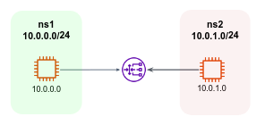

# Exercise 1
Use the `ip neighbor` command to find the MAC address of your default gateway interface.
<details>
  <summary>
    Solution
  </summary>

```bash
myuser@hostname:~$ route -n
Kernel IP routing table
Destination 	Gateway     	Genmask     	Flags Metric Ref	Use Iface
0.0.0.0     	192.168.0.1 	0.0.0.0     	UG	600	0    	0 wlp4s0
192.168.0.0 	0.0.0.0     	255.255.255.0   U 	600	0    	0 wlp4s0
myuser@hostname:~$ ip neighbor show 192.168.0.1
192.168.0.1 dev wlp4s0 lladdr a4:98:13:8f:6c:2e REACHABLE
```
`A4:98:13:8f:6c:2e` is the MAC address.

</details>

# Exercise 2 - Network Design
Design a network of four different subnets with 250 machines, 12 machines, 112 machines and 53 machines respectively. Your network administrator gave you `10.88.132.0/22` CIDR for these subnets. What are the four subnets address you would like to assign to those three subnets? You must provide CIDR in the form of `/24`. 
<details>
  <summary>
    Solution
  </summary>

Putting 10.88.132.0/22 CIDR in cidr.xyz, we can see that there are 1024 available addresses, and the last 2 bits of the 3rd octet are free. 

CIDR notation: 10.88.132.0/22
Binary representation: **00001010.01011000.100001**00.00000000 / 22

Since we are required to provide cidr ends with /24 for each subnet, the only possible option is:
1. 10.88.132.0/24
  (**00001010.01011000.100001**00.00000000 / 22)
1. 10.88.133.0/24
  (**00001010.01011000.100001**01.00000000 / 22)
1. 10.88.134.0/24
  (**00001010.01011000.100001**10.00000000 / 22)
1. 10.88.135.0/24
  (**00001010.01011000.100001**11.00000000 / 22)

</details>

# Exercise 3 - Virtual Internet Gateways
In this exercise, we will create a pair of virtual network interfaces on your local machine. A virtual network interface is a software-based interface that emulates a physical network interface, allowing us to create multiple logical networks on a single physical machine. We will then perform a network performance test using `iperf` to see the impact of the bandwidth and latency restrictions on network performance. The goal of this exercise is to demonstrate the use of virtual network interfaces and traffic control in a practical network scenario.
1. In our shared Git repo, under the virtual_nic directory in our shared repo, execute the init.sh script to start the exercise. Note that the script should be run as root. At the end of the execution, you’ve effectively created a network consists of 2 “subnets” (under the hood, these are not real subnets, but only two isolated network namespaces) with two different network interfaces that can send traffic to each other:  
    ```bash
    $ sudo bash -e init.sh
    ```
    
1. Now, start a bash session “within” subnet `ns1` (again, we use the term “subnet” just to get you to understand the simulated scenario.  From now on, instead of subnet, we will use the correct term - network namespace)
    ```bash
    $ sudo ip netns exec ns1 bash
    ```
1. In another terminal windows, start a bash session within network namespace `ns2`:
    ```bash
    $ sudo ip netns exec ns2 bash
    ```

**Tasks**:
1. First, explore your system, perform `ip address` to see the network interfaces in each network namespace, and explore the route table. 
1. `ping` `ns2` from `ns2`, make sure the ping succeeds. 
1.  From `ns2`, use `iperf` to run a testing server by:
    ```bash
    $ iperf -s
    ``` 
    `iperf` is a network performance testing tool that can measure the bandwidth, packet loss, and latency of network connections. The server is using TCP and port 5001 by default. 
1. From `ns1`, perform a networking performance test using `iperf` as a client:
    ```bash
    $ iperf -c <ip-of-ns1-interface>
    ```
    The test results should be similar to:
    ```bash
    ------------------------------------------------------------
    Client connecting to 10.0.0.1, TCP port 5001
    TCP window size:  340 KByte (default)
    ------------------------------------------------------------
    [  1] local 10.0.0.0 port 40024 connected with 10.0.0.1 port 5001
    [ ID] Interval   	Transfer 	Bandwidth
    [  1] 0.0000-10.0339 sec  1.22 GBytes  1.05 Gbits/sec
    ```
1. Stop the server in `ns1`. 
1. We will now use the `tc` command to restrict the performance of `ns1` virtual interfaces. From the bash terminal of `ns1`, execute the below commands:
    ```bash
    tc qdisc add dev eth0 root handle 1: tbf rate 1mbit burst 32kbit latency 400ms
    tc qdisc add dev eth0 parent 1:1 handle 10: netem loss 5%
    ```
1. Perform the above test again, what are the results? How was the network bandwidth damaged?  
1. Stop the server in `ns1` and now run it as a UDP server: 
    ```bash
    $ iperf -s -u
    ```
1. Execute the client test from `ns2`:
    ```bash
    $ iperf -c <ns10-interface-ip>-u -b 1M -l 100
    ```
What is the packet loss percentage? 