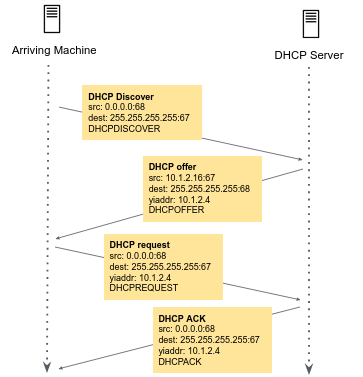

In order to obtain a block of IP addresses for use within a subnet, a network administrator might first contact its internet service provider (ISP), which would provide addresses from a larger block of addresses that had already been allocated to the ISP. In general, IP addresses are managed under the authority of the Internet Corporation for Assigned Names and Numbers ([ICANN](https://www.icann.org/)).

The Dynamic Host Configuration Protocol (**DHCP**) allows a host to obtain an IP address automatically within a subnet.

The below diagram examines the process by which a new client receives an IP address from a DHCP server:

##### The Discover, Offer, Request, Acknowledge (DORA) Process

The DORA process refers to the four steps that are involved in DHCP client-server interaction. These four steps are:

1. Discover: The client **broadcasts** a DHCP discover message on the local network, requesting an IP address lease from any available DHCP server.
1. Offer: DHCP servers on the local network respond to the broadcast with a DHCP offer message, which includes an available IP address, lease duration, and other configuration parameters.
1. Request: The client selects one of the offered IP addresses and sends a DHCP request message to the DHCP server, requesting the lease.
1. Acknowledge: If the DHCP server approves the client's request, it sends a DHCP acknowledge message to the client, confirming the IP address lease and providing any other configuration parameters.

The DORA process allows a DHCP client to obtain an IP address and other configuration information from a DHCP server. It is an important part of network configuration, as it enables automatic IP address assignment and ensures consistency in network settings across multiple devices.