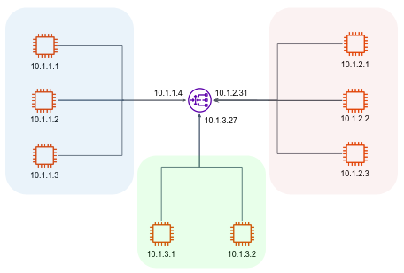

Computer networks organize machines into sub networks, or **subnets**. All machines on a given subnet may exchange information directly. Subnets are in turn linked to other subnets by machines acting as **routers**.

The above network consists of 3 subnets. Taking a closer look, we notice that computers under the same subnet have the same ip prefix. For example, all computers under the leftmost subnet (and all computers that will join this subnet) have an IP address starting by `10.1.1.xxx`. Thus, they share the same IP prefix, more precisely, the same first **24 bits** in their IP address.

We will denote the IP boundaries of the leftmost subnet by:
```bash
10.1.1.0/24
```
This method is known as **Classless Interdomain Routing (CIDR)**.

The CIDR `10.1.1.0/24` represents a network address in IPv4 format with the network prefix length of 24 bits. This means that the first 24 bits of the IP address, i.e., the first three octets, specify the **network portion**, and the remaining 8 bits, i.e., the fourth octet, represent the **host portion**. In this case, the network address is `10.1.1.0`, and there are 256 possible host addresses (2^8 = 256) within this network, ranging from `10.1.1.1` to `10.1.1.254` (the first and last IP addresses are reserved).

Another method to denote network subnet is subnet mask. This format specifies the number of fixed octates of the IP as 255, and the free octates as 0. The equivalent subnet mask for `10.1.1.0/24` is `255.255.255.0`,  which means the first 3 octets are the network portion (fixed) and 4th octet is the hosts portion (change per machine in the subnet).

Use [this nice tool](https://cidr.xyz/) to familiarize yourself with CIDR notation.

The `ping` command can be used to confirm IP connectivity between two hosts:
```bash
myuser@10.1.1.1:~$ ping 10.1.2.2
PING 10.1.2.2 56(84) bytes of data.
64 bytes from 10.1.2.2: icmp_seq=1 ttl=51 time=3.29 ms
64 bytes from 10.1.2.2: icmp_seq=2 ttl=51 time=3.27 ms
64 bytes from 10.1.2.2: icmp_seq=3 ttl=51 time=3.28 ms
...
```
In the above example, the computer identified by the IP `10.1.1.1` sends ping frames to `10.1.2.2`.

In order to communicate with a host on another subnet, the data must be passed to a router, which routes the information to the appropriate subnet, and from there to the appropriate host. Before examining that mechanism, let's introduce 3 important concepts: **Route table, Default gateway, Network interfaces**.