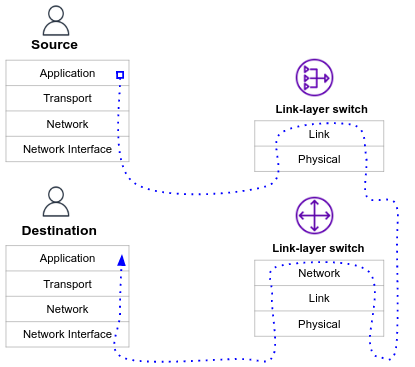

When connecting to a machine outside of your subnet, your packet is passed from router to router as it traverses various subnets, until finally the packet is delivered to the subnet which contains the destination machine.

The path of the packet, as it is passed from router to router, can be traced with the `traceroute` command. The traceroute command is generally called with a single argument, the hostname or IP address of the destination machine.
```bash
myuser@hostname:~$ traceroute google.com
traceroute to google.com (142.250.74.46), 30 hops max, 60 byte packets
 1  ec2-13-53-0-203.eu-north-1.compute.amazonaws.com (13.53.0.203)  1.665 ms * *
 2  * * 240.0.16.13 (240.0.16.13)  0.170 ms
 3  241.0.2.197 (241.0.2.197)  0.176 ms 241.0.2.200 (241.0.2.200)  0.208 ms 241.0.2.198 (241.0.2.198)  0.165 ms
 4  240.0.16.19 (240.0.16.19)  0.180 ms 242.0.124.121 (242.0.124.121)  1.926 ms 242.0.125.105 (242.0.125.105)  0.375 ms
 5  242.0.124.97 (242.0.124.97)  0.614 ms 52.93.142.149 (52.93.142.149)  3.929 ms 52.93.142.181 (52.93.142.181)  3.913 ms
 6  52.93.142.149 (52.93.142.149)  3.916 ms  3.868 ms 52.93.145.226 (52.93.145.226)  2.764 ms
 7  52.93.145.54 (52.93.145.54)  3.274 ms 52.93.143.27 (52.93.143.27)  3.920 ms 52.93.145.184 (52.93.145.184)  18.886 ms
 8  99.83.118.165 (99.83.118.165)  3.272 ms 52.93.143.69 (52.93.143.69)  11.419 ms 99.83.118.165 (99.83.118.165)  3.148 ms
 9  99.83.118.165 (99.83.118.165)  3.196 ms * *
10  * * *
11  108.170.254.33 (108.170.254.33)  4.244 ms 142.251.48.40 (142.251.48.40)  3.323 ms 108.170.254.54 (108.170.254.54)  7.028 ms
12  108.170.253.177 (108.170.253.177)  3.350 ms 142.250.239.183 (142.250.239.183)  3.142 ms 108.170.254.54 (108.170.254.54)  3.790 ms
13  142.250.239.185 (142.250.239.185)  3.611 ms  3.616 ms 108.170.253.161 (108.170.253.161)  3.833 ms
14  arn09s22-in-f14.1e100.net (142.250.74.46)  3.533 ms  3.093 ms 142.250.239.183 (142.250.239.183)  3.936 ms
```
The number of routers that your packet passes through is generally referred to as the number of **hops** the packet has made. 14 hops are observed in the above example. Every hop is sampled 3 times. This is done to ensure that the measurements are accurate and reliable, as network traffic is often unpredictable and can fluctuate due to various factors such as congestion or network errors. Every sample denoted by the milliseconds it took for a packet to travel from the source host to the specific hop and back again.
