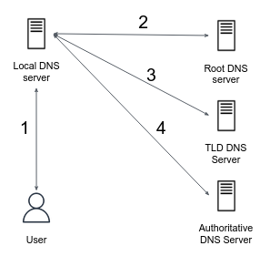

{Check It!|assessment}(multiple-choice-412216983)
{Check It!|assessment}(multiple-choice-46523765)
{Check It!|assessment}(multiple-choice-648483901)
{Check It!|assessment}(multiple-choice-4155952312)
{Check It!|assessment}(multiple-choice-4078807086)

Given a client, local DNS server, root level, TLD and authoritative servers, as described here: 

Suppose that the local DNS server caches all information coming in from all root, TLD, and authoritative DNS servers for 20 seconds.  Assume also that the local DNS server cache is initially empty. The client has no any caching mechanism. Assume that a DNS query latency is 2 seconds (1 second for each side - request and response) for all servers (client - local DNS, local DNS - root level, local DNS - TLD, local DNS - authoritative server). 

Consider the following DNS requests, made by some clients at the following order:

1. `google.com`
1. `icann.org`
1. `amazon.com`
1. `google.com`
1. `cnn.com`
1. `google.com`

Answer the following 3 questions. When you're asked to calculate the resolve time of a given domain, count only the time it takes to resolve the domain itself, exclude the time taken to resolve the previous domains in the list

{Check It!|assessment}(multiple-choice-1442228902)
{Check It!|assessment}(multiple-choice-2581790364)
{Check It!|assessment}(multiple-choice-1046015898)
{Check It!|assessment}(multiple-choice-565051862)
{Check It!|assessment}(multiple-choice-1925895310)