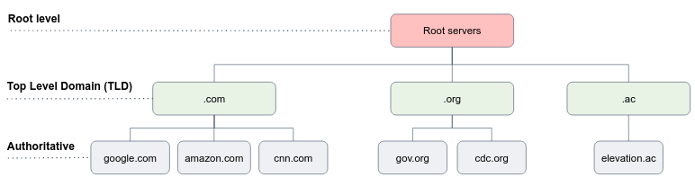

The DNS service is complex. The protocol that specifies how the DNS servers and querying hosts communicate consists of a large number of DNS servers distributed around the globe.

A simple design for DNS would have one DNS server that contains all the mappings (which is a bad idea! why?).

Answer
- Single point of failure
- High traffic volume
- Distant centralized DB
- Maintenance

In fact, DNS is a wonderful example of how a distributed database can be implemented on the Internet. Let's delve into details. There are three classes of DNS servers: **root** DNS servers, **top-level domain** (TLD) DNS servers, and **authoritative** DNS servers.

- **Root DNS servers** - clients first contact one of the root servers, which returns IP addresses for TLD servers for the top-level domain. As of 2012, there are 13 root DNS servers (actually 247 after replication).
- **Top-level domain (TLD) servers** - are responsible for top-level domains such as .com, .org, .net, .edu, and .gov, and all of the country's top-level domains such as uk, fr etc... Look [here](https://www.iana.org/domains/root/db) for a full list. When a client reaches a TLD server in order to resolve a domain name, e.g. google.com, it is **not** responded with the desired IP address of the domain, but with a list of Authoritative Servers from which to request the desired IP address.
- **Authoritative DNS servers** - every organization with publicly accessible hosts must provide publicly accessible DNS records that map the names to IP addresses. Authoritative name servers are the source of truth in the domain name system. An organization can choose to implement its own authoritative DNS server to hold these records, alternatively, to pay to have these records stored in an authoritative DNS server of some service provider, e.g. [AWS route53](https://docs.aws.amazon.com/Route53/latest/DeveloperGuide/domain-register.html).