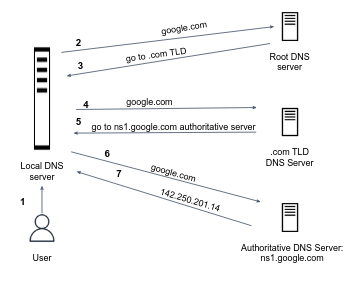

In real life, the actual hostname resolution is done by your ISP local DNS server. Every ISP maintains its own local DNS server. When a host connects to an ISP, it provides the IP addresses of its local DNS server(s). When a host makes a DNS query, the query is sent to the local DNS server, which acts as a **proxy**, forwarding the query into the DNS server hierarchy.

The IP address of your local DNS server can be found in `/etc/resolv.conf`.