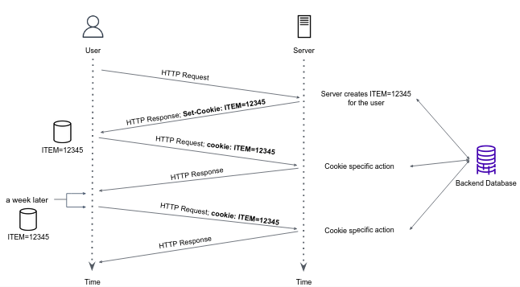

We mentioned that an HTTP server is stateless. This simplifies server design and has permitted engineers to develop high-performance Web servers that can handle thousands of simultaneous TCP connections. However, it is often desirable for a website to remember stateful information of users. For this purpose, HTTP uses **cookies**.

An HTTP cookie is a small piece of data that a server sends to a user's web browser. The browser may store the cookie and send it back to the same server with later requests. Most major commercial websites use cookies today.


As shown in the figure above, a cookie has four components:
1. `Set-Cookie` header line in the HTTP **response** message, usually in the form of `key=value`.
1. `Cookie` header line in the HTTP **request** message.
1. A cookie file kept on the user’s end system and managed by the user’s browser.
1. A back-end database at the website.

Suppose Berta contacts Amazon.com for the first time. When the request comes into the Amazon server, the server creates a unique id and creates an entry in its back-end database that is indexed by the id. Amazon  server then responds to Berta’s browser, including in the HTTP response a `Set-cookie` header, which contains the id value. For example, the header line might be: 
```bash
Set-cookie: ITEM=12345
```
When Berta’s browser receives the HTTP response message, it sees the `Set-cookie` header, and appends a line to the special cookie file that it manages locally.

As Berta continues to browse the Amazon site, each time she requests a web page, her browser consults her cookie file, extracts her id value for this site, and puts a cookie header line that includes the id value in the HTTP request. Specifically, each of her HTTP requests to the Amazon server includes the header line:
```bash
Cookie: ITEM=12345
```
In this manner, Amazon server is able to track Berta’s activity, it knows exactly which pages she visited, in which order, and at what times!

#### *The Dark Side of Cookies*

Although cookies often simplify and improve user experience, they are controversial because they can also be considered as an invasion of privacy.
As we just saw, using a combination of cookies and user-supplied account information, a website can learn a lot about a user and potentially sell this information to a third party. The [GDPR](https://gdpr.eu/cookies/) website includes extensive information on cookies compliance requirements.