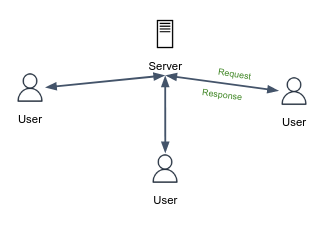

The Hypertext Transfer Protocol (HTTP) is an application-level protocol that is widely used over the Web. HTTP is a **request/response** protocol, which means, the client sends a request to the server in the form of a request method, URI, protocol version, followed by headers, and possible body content. The server responds with a status code line, a success or error code, followed by server headers information, and possible entity-body content.

Under the hood, HTTP requests and responses are sent over a TCP socket with default port 80 (on the server side). The HTTP client first initiates a TCP connection with the server, once the connection is established, the client and the server access TCP through their respective socket interfaces.

Here we see one of the great advantages of the layered architecture of the OSI model — HTTP doesn't need to worry about data loss and integrity. This is the job of TCP and other protocols in lower layers.

HTTP is said to be a **stateless protocol**. The server sends the requested content to clients without storing any information about the client. If a particular client sends the same request twice in a period of a few seconds, the server does not respond by saying that it just served the same request to the client. Instead, the server re-sends the data, as it has completely forgotten what it did earlier.

Nevertheless, although HTTP itself is stateless by design, most modern servers have a complex backend logic that stores information about logged-in clients, and by this means, we can say that those servers are **stateful**.