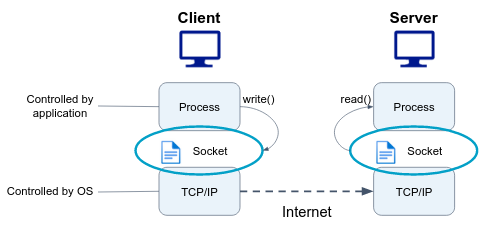

A **socket** is a communication endpoint that allows processes to communicate with each other, either on the same machine or across a network. A socket is identified by a unique combination of an **IP address** and a **port number**, and it is associated with a particular protocol, usually TCP or UDP.

Linux sockets provide a standardized interface for networking communication, and they are used by many network applications, such as web browsers, email clients, etc... Sockets can be used to establish connections between clients and servers, or to implement peer-to-peer communication between two applications.
