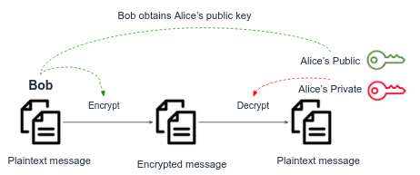

In the previous section we've seen how client and server can communicate using a shared key. But keep in mind that this key must be agreed by both sides first. **How can both parties agree on a key if the only communication channel they have is unsecure?** Can you come up with a way that both parties can securely exchange the secret with which they will encrypt and decrypt messages?

We can achieve it using Asymmetric Encryption.

Asymmetric key encryption, also known as **public key cryptography**, uses a pair of related keys to encrypt and decrypt data. One key, known as the **public key**, is shared with anyone who wants to send encrypted data to the owner of the key. The other key, known as the **private key**, is kept secret and used to decrypt data that has been encrypted with the public key.

Let's generate a public-private key pair and encrypt messages. We will use `openssl` again.

Generate a `1024` bit length private key. Choose an easy pass phrase for your key, so you can remember it later.
```bash
openssl genrsa -aes256 -out private.key 1024
```
Take a look at your private key.

Using the generated private key, generate the public key pair:
```bash
openssl rsa -in private.key -pubout -out public.key
```
Take a look at your private key.

Encrypt a message by:
```bash
openssl rsautl -encrypt -pubin -inkey public.key -in message.txt -out encrypted_message.txt
```
Can you see that only the public key has been used to encrypt the message, and since public keys are not secrets, everyone can encrypt messages and send them to the owner of the public key, so he could decrypt them using his private key.

Let's decrypt the file by:
```bash
openssl rsautl -decrypt -inkey private.key -in encrypted_message.txt
```