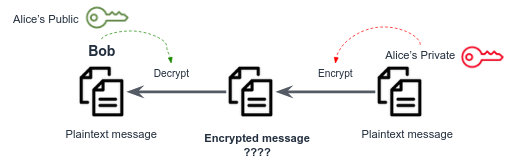

Take a closer look at the below encryption scheme. Now Alice is sending a message to Bob. She encrypts the message using her **private key**, and Bob decrypts it using Alice's **public key**.

What is wrong here?

This scheme has no meaning in terms of encryption! But it can be a useful technique to verify the **authenticity and integrity** of a message.

Remind yourself that Eve is not only able to read the transferred messages between Bob and Alice, but also to **edit** any message. And now the parties have another concern other than privacy: how can Bob know that incoming messages from Alice are authentic? That they were not altered by Eve?

The private key is used to **sign** the data and the recipient uses the sender's public key to verify the digital signature.

We will use the above key-pair to sign a message:
```bash
openssl dgst -sha256 -sign private.key -out signature.txt message.txt
```
Now `signature.txt` is your signature for the message `message.txt`. Alice sends **both** `message.txt` and `signature.txt` to Bob (we don't care about privacy here, only authenticity!).

Bob now verifies that the message he got, `message.txt`, indeed written by Alice:
```bash
openssl dgst -sha256 -verify public.key -signature signature.txt message.txt
```