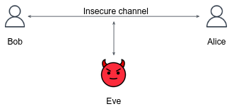

Alice, Bob, and Eve are often used in cryptography to represent different entities with varying levels of trust. Alice and Bob are usually considered trusted parties who want to communicate securely, while Eve is an eavesdropper who wants to intercept their communication. Eve can **see and change** every message that is being sent over the channel.

For example, Alice may represent a bank company website, while Bob is a bank customer who wants to perform some actions on his online account. If the communication channel is not secured (the data is sent as a plain text), Eve, as an eavesdropper, can capture the login credentials of Bob, or, change the messages that Bob sends to the Bank (e.g. send 100$ to ~~John~~ Eve's account).

In this tutorial, we will be learning the fundamentals of network security and encryption.