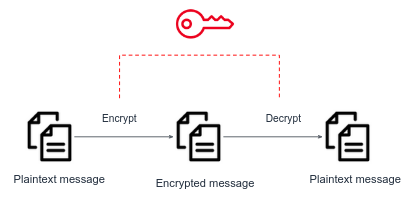

Symmetric key encryption is a method of cryptography in which the same secret key is used for both encryption and decryption.

We'll use `openssl` to encrypt messages:
```bash
myuser@hostname:~$ echo "vv7:K0r|E[PC!JM" > .secretKey
myuser@hostname:~$ echo "I'm Bob, want to transfer 500$ to John using the following credit card number 1234 1234 1234 1234" > message.txt
myuser@hostname:~$ openssl enc -e -aes-256-cbc -salt -in message.txt -out encrypted_message.txt -pass file:.secretKey
myuser@hostname:~$ cat encrypted_message.txt
Salted__'ǝjo7....
```
The above example encrypts the content of `message.txt` using a key stored under `.secret`. The resulting output was created under `encrypted_message.txt`. This file can be sent safely over any channel, since it contains Gibberish for a person who doesn't know the secret key.

The above `openssl` command was executed with the following flags:
- `-d` Decrypt file
- `-aes-256-cbc` The symmetric encryption algo name
- `-salt` Adds a salt to the key to make it more secure.
- `-k` User password
- `-in` The input file
- `-out` The output file
- `-pass` Specifies the path to the file containing the key used for encryption (.secret in out case)

Read [openssl docs](https://www.openssl.org/docs/manmaster/man1/openssl-enc.html) for more information.

We now want to decrypt the encrypted file:
```bash
myuser@hostname:~$ openssl enc -d -aes-256-cbc -salt -in encrypted_message.txt -out original_message.txt -pass file:.secretKey
myuser@hostname:~$ cat original_message.txt
I'm Bob, want to tr...
```