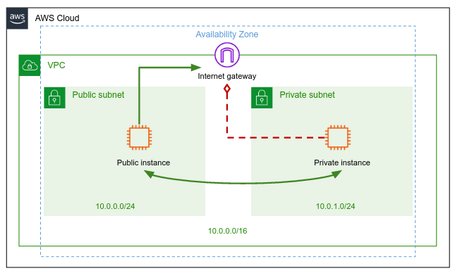

Extend your VPC according to the below architecture:




**Note**: No need to create **NAT gateway** in any way you choose to build the above VPC architecture.

Create an EC2 instance in your **private subnet**. Can you connect it from your local machine? No... it has no public IP, and it is not accessible at all.

Think how you can use the **public instance** to connect to the **private instance**. Once you're in the private instance, try to access the internet and make sure you don't have access.


Fill in the variables in `networking_project/vpc.sh` according to your VPC id, and instances IDs. The information can be found in the AWS console. E.g.:

```bash
REGION="eu-north-1"
VPC_ID="vpc-0b0a99ab119eb0cf7"
PUBLIC_INSTANCE_ID="i-0a3348dc225308c83"
PRIVATE_INSTANCE_ID="i-0b0cf0d94e141be6b"
```

Add the course staff public key to your `~/.ssh/authorized_keys` file of your **public instance**. This way we can connect to your instance and perform the automatic test of your solution.

```text
ssh-rsa AAAAB3NzaC1yc2EAAAADAQABAAABgQC32uHSDe2GZAGSczIiRGpBo92Se61o6I2D2cVh5rwk7xikQXL8/ODhRgk2sB7xcLEWFbK/80SSFWaZDc+6YRv5zI0JFHpU4lxXYo83u268w12o74pjxBRQoKloJJd0cJWvFgfkbsdZp/G/qeF3hv6yzIfGjRMw+1TxEXX6Lo7JP7q2u1L7W/FoGkX+P3P7kdI9F2F+35YGmzDvZSdvqa6BzDiQxXkiCDppt2LpjV91hmn6alPhwetDIuuAg0w2lkJqkQmzo9As16i//+7hUANGKqAiUXkicDaj1qRNp1NcWFd3G+oEcv+18MncEf5hCJo5DIYau86qC7sg+ceAtl6OAKiQg7T3Md9QVvlY/7tprz0bew/Pof447YMHsCiNlJvlEQ2cFOb3BSp3N6ub72w+xK4i7E/3jB9YCi6ocqzvl5+7wcUtr8pJ5Yr/APck/crTUxK+C+RvG5maPHuvY3vhj77r0I2fAexbDPYywE6gavDSbuFPM8RRyW4792sKuZM= alon@alon-ThinkPad-E450
```
